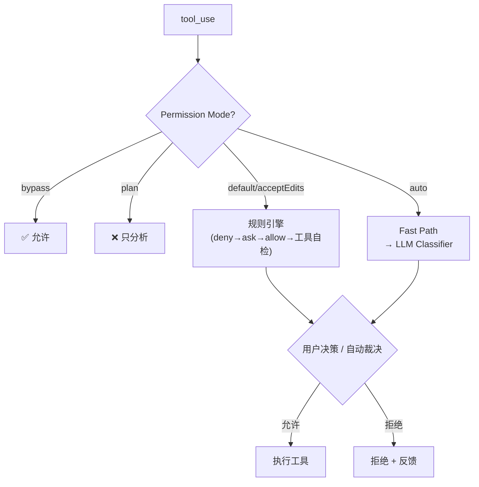
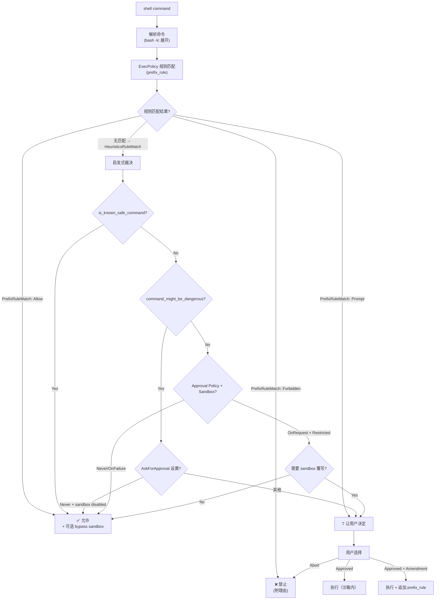
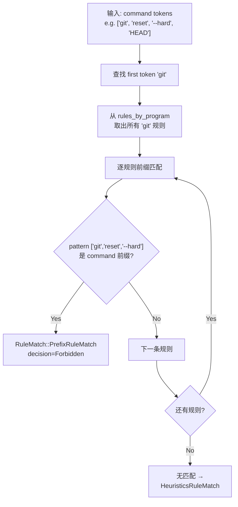
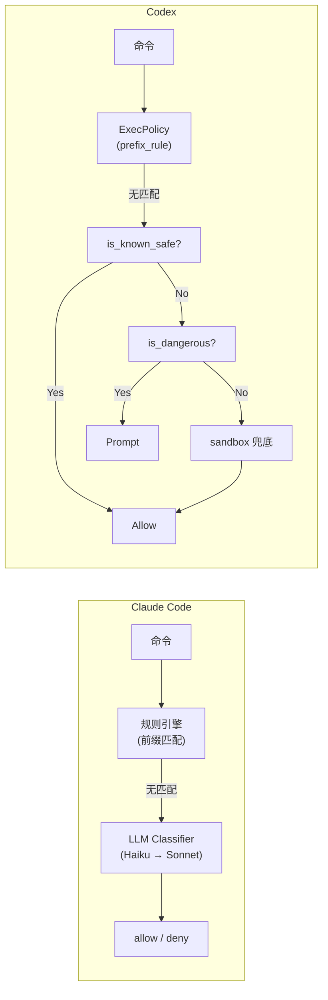

# Agent 规则匹配引擎对比：Claude Code vs Codex

> 基于 Claude Code v2.1.85 bundle 逆向工程 + Codex (OpenAI) 开源代码分析
>
> 本文对两款主流 AI 编码 Agent 的权限/规则匹配引擎进行并排拆解——从设计哲学到每一条命令如何被裁决。附带对先前 [Claude Code 权限系统文档](./claude-code-permission-system.md) 的事实性核查结果。

---

## 目录

1. [设计哲学对比](#1-设计哲学对比)
2. [架构总览对比](#2-架构总览对比)
3. [命令规则匹配引擎](#3-命令规则匹配引擎)
4. [文件系统权限模型](#4-文件系统权限模型)
5. [网络权限模型](#5-网络权限模型)
6. [命令安全分类：静态启发式](#6-命令安全分类静态启发式)
7. [沙箱集成](#7-沙箱集成)
8. [配置层级与规则合并](#8-配置层级与规则合并)
9. [事实核查：Claude Code 权限文档勘误](#9-事实核查claude-code-权限文档勘误)
10. [实现建议总结](#10-实现建议总结)
11. [附录：核心源码位置对照](#附录核心源码位置对照)

---

## 1. 设计哲学对比

| 维度 | Claude Code | Codex |
|------|-------------|-------|
| **核心理念** | "默认安全，渐进开放"：一切需要 ask，用户通过规则/模式逐步放开 | "沙箱优先，规则细化"：沙箱兜底，exec policy 精确控制命令 |
| **规则表达** | 声明式 `Tool(specifier)` 语法，嵌入 JSON settings | Starlark DSL（`.rules` 文件），`prefix_rule()` 函数式声明 |
| **匹配粒度** | 工具级别（Bash/Edit/Read/WebFetch），specifier 做二次匹配 | 命令级别（token 序列前缀匹配），文件和网络独立策略 |
| **智能层** | LLM 分类器（auto-mode）做语义级判断 | 静态启发式（safe/dangerous command lists）+ Guardian 风险评估 |
| **安全兜底** | 权限提示 UI + Hook 系统 | 操作系统级沙箱（seatbelt/seccomp/landlock）+ 网络代理 |
| **开源状态** | 闭源（bundle 逆向） | 完全开源（Rust + TypeScript） |

**核心差异**：Claude Code 更"智能"（LLM 做决策），Codex 更"确定性"（静态规则 + 沙箱）。

两者对"安全"的定义不同：
- **Claude Code** 的基线是"是否应该让人类确认"——权限系统的核心输出是 `allow/deny/ask`。
- **Codex** 的基线是"是否应该在沙箱外运行"——权限系统的核心输出是 `Allow/Prompt/Forbidden`，且 `Allow` 的命令也在沙箱内执行。

---

## 2. 架构总览对比

### Claude Code 决策管道



### Codex 决策管道



**关键区别**：
1. Claude Code 的入口是 **工具** 级别（Bash/Edit/Read），每个工具有自己的 `checkPermissions()` 
2. Codex 的入口是 **命令** 级别（token 序列），所有命令共用一套 exec policy

---

## 3. 命令规则匹配引擎

### 3.1 Claude Code：`Tool(specifier)` + `ignore` 库

**规则语法**：
```
Bash(npm test)         → 命令前缀匹配
Edit(docs/**)          → .gitignore 风格 glob 路径匹配
WebFetch(domain:*.com) → 域名匹配
```

**路径匹配算法**（`matchPathRule` / bundle 中 `OH()`）：
1. 规范化路径（macOS `/private` 去除）
2. 收集所有规则来源的 `(root, pattern)` 对
3. 按 root 分组，对每组构建 `ignore` 实例
4. 逐组测试 relative path → 返回第一个匹配

**Bash 命令匹配**（`checkBashPermission` / bundle 中 `wm1()`）：
1. tree-sitter 解析为 AST → 拆分子命令
2. 每个子命令做 **文本前缀匹配**（不是 glob）
3. 可选的 LLM 语义规则匹配（自然语言 deny/ask 规则）

**优先级硬编码**：`deny > ask > allow`，不可配置。

### 3.2 Codex：`prefix_rule()` + Starlark DSL

**规则语法**（`.codexpolicy` / `.rules` 文件）：
```starlark
prefix_rule(
    pattern = ["git", "reset", "--hard"],
    decision = "forbidden",
    justification = "destructive operation",
)

prefix_rule(
    pattern = ["npm", "test"],
    decision = "allow",
)
```

**匹配算法**（`Policy::check()` → `matches_for_command()`）：



**关键实现细节**：

1. **HashMap 索引**：规则按第一个 token 索引到 `MultiMap<String, RuleRef>`，O(1) 查找
2. **前缀匹配**：`PrefixPattern` 包含 `first` + `rest`，rest 中的 token 支持 `PatternToken::Single` 和 `PatternToken::Alts`（多选项）
3. **Host Executable 解析**：当命令以绝对路径开头（如 `/usr/bin/git`）时，提取 basename 再做规则匹配
4. **多命令聚合**：`check_multiple()` 对 `bash -lc "cmd1 && cmd2"` 解析后的所有子命令独立检查，取最严格的 `Decision`
5. **Decision 优先级**：`Forbidden > Prompt > Allow`（通过 `Ord` derive 实现）

### 3.3 核心差异

| 维度 | Claude Code | Codex |
|------|-------------|-------|
| **规则格式** | JSON 内嵌（settings.json） | Starlark 脚本（.rules 文件） |
| **匹配算法** | Path: `ignore` 库 glob<br/>Bash: 文本前缀 + 可选 LLM | Token 序列前缀匹配<br/>HashMap 索引 + Ord 优先级 |
| **子命令处理** | tree-sitter AST 拆分 | `parse_shell_lc_plain_commands()` 文本解析 |
| **规则测试** | 无内置测试 | 内置 `match/not_match` 数组用于规则自测 |
| **动态追加** | 用户在 UI 中 "Always allow" | `append_amendment_and_update()` 追加 `prefix_rule` |
| **规则来源** | 6 层 settings 合并 | `ConfigLayerStack` 多层 `.rules` 文件合并 |

---

## 4. 文件系统权限模型

### 4.1 Claude Code：工具级路径检查

每种文件工具（Read/Edit/Write）有独立的 `checkPermissions()` 函数：

```
Read(path):  安全检查 → deny 匹配 → ask 匹配 → 工作目录检测 → allow 匹配 → 默认 ask
Write(path): deny 匹配 → 全局写允许 → allow 匹配 + safetyCheck → 默认 ask
```

路径权限通过 `ignore` 库做 glob 匹配（同规则引擎），嵌入文件工具的 `checkPermissions` 流程中。

### 4.2 Codex：基于 entry 的文件系统沙箱策略

Codex 使用更结构化的 `FileSystemSandboxPolicy`：

```rust
// 三种沙箱模式
enum FileSystemSandboxKind {
    Restricted,      // 默认：只允许声明的路径
    Unrestricted,    // 无限制
    ExternalSandbox,  // 外部沙箱管理
}

// 每个 entry = (路径, 访问级别)
struct FileSystemSandboxEntry {
    path: FileSystemPath,  // 具体路径或特殊路径(:root, :cwd, :tmpdir, :slash_tmp)
    access: FileSystemAccessMode,  // Read | Write | None
}
```

**路径解析算法**（`resolve_access_with_cwd()`）：
```
1. 将请求路径解析为绝对路径
2. 遍历所有 resolved entries
3. 过滤: 只保留 entry.path 是请求路径的祖先路径的 entries
4. 取最长前缀匹配 (max_by_key = 路径组件数量)
5. 同等长度时，按 conflict precedence: None > Write > Read
6. 返回匹配 entry 的 access mode
```

### 4.3 对比

| 特性 | Claude Code | Codex |
|------|-------------|-------|
| **匹配方式** | .gitignore glob (`ignore` 库) | 最长前缀路径匹配 (starts_with) |
| **特殊路径** | macOS `/private` 规范化 | `:root`, `:cwd`, `:tmpdir`, `:slash_tmp`, `:minimal`, `:project_roots` |
| **deny 机制** | deny 规则最高优先级 | `access: None` 条目 + conflict precedence |
| **动态扩展** | allow 规则追加到 settings | `with_additional_writable_roots()` / `with_additional_readable_roots()` |
| **保护路径** | `.ssh/`, `.claude/`, 敏感文件列表 | `.git/`, `.codex/` 在 writable root 内自动标记为 read-only |

> [!IMPORTANT]
> Codex 的 `default_read_only_subpaths_for_writable_root()` 自动将 writable root 下的 `.git/` 和 `.codex/` 标记为 read-only——这是一个优雅的设计，确保即使项目根目录可写，版本控制和 agent 配置仍受保护。

---

## 5. 网络权限模型

### 5.1 Claude Code

通过 `WebFetch(domain:*.example.com)` 规则控制，走通用的 `matchPathRule()` 路径匹配器。
无独立的网络代理层。

### 5.2 Codex

Codex 有完整的网络代理层（`codex-rs/network-proxy/`）：

**网络规则**：
```starlark
network_rule(
    host = "api.github.com",
    protocol = "https",
    decision = "allow",
    justification = "GitHub API access needed",
)
```

**域名匹配**（`compile_allowlist_globset()` / `compile_denylist_globset()`）：
- 使用 `globset::GlobSet` 构建编译后的域名匹配器
- 支持 `*.example.com`（仅子域）和 `**.example.com`（含 apex）
- 域名规范化：大小写、端口剥离、IPv6 括号、尾部点号
- **SSRF 防护**：`is_non_public_ip()` 检测私有 IP（RFC 1918/6598/6890 等）

**域名模式匹配矩阵**：

| 规则 | `example.com` | `api.example.com` | `deep.api.example.com` |
|------|:---:|:---:|:---:|
| `example.com` | ✅ | ❌ | ❌ |
| `*.example.com` | ❌ | ✅ | ✅ |
| `**.example.com` | ✅ | ✅ | ✅ |

---

## 6. 命令安全分类：静态启发式

### 6.1 Claude Code

Claude Code 使用 **LLM 分类器**（auto-mode）做语义级安全判断，没有内置的静态安全/危险命令列表。

唯一的静态列表是 auto-mode 的 **安全工具白名单**（`isAutoModeAllowlistedTool()` / bundle 中 `YTY()`），但这是工具级别（Read, ListDir, Grep 等），不是命令级别。

### 6.2 Codex

Codex 使用精心维护的 **双向静态启发式**：

**安全命令白名单** (`is_known_safe_command()`)：

| 命令 | 安全条件 |
|------|---------|
| `cat`, `ls`, `pwd`, `echo`, `head`, `tail`, `grep`, `wc`, `which`, `whoami` 等 25+ | 无条件安全 |
| `find` | 不含 `-exec`, `-delete`, `-fls` 等危险选项 |
| `rg` (ripgrep) | 不含 `--pre`, `--hostname-bin`, `--search-zip` |
| `git status/log/diff/show` | 不含 `--output`, `--exec`, `-c`(config override) |
| `git branch` | 仅含 `--list`, `--show-current`, `-v` 等只读 flag |
| `base64` | 不含 `-o`/`--output` |
| `sed -n {N}p` | 仅限 print 模式 |
| `bash -lc "cmd1 && cmd2"` | 展开后每个子命令都安全 |

**危险命令黑名单** (`command_might_be_dangerous()`)：

| 命令 | 判定条件 |
|------|---------|
| `rm -f`, `rm -rf` | 强制删除 |
| `sudo <cmd>` | 递归检查 `<cmd>` |
| `bash -lc "... dangerous ..."` | 展开后任一子命令危险 |

**禁止的"Always Allow"前缀** (`BANNED_PREFIX_SUGGESTIONS`)：
```
python3, python, bash, sh, zsh, git, node, perl, ruby, php, lua, osascript,
sudo, env, pwsh, powershell 等
```
这些程序如果被 "Always Allow"，等于给 agent 一个不受限的执行器——永远不会被建议为 `ExecPolicyAmendment`。

### 6.3 对比



---

## 7. 沙箱集成

### 7.1 Claude Code

- **文件系统沙箱**：`allowOnly` / `denyWithinAllow` 路径列表
- **命令沙箱**：`@anthropic-ai/sandbox-runtime`（seccomp），可选
- 沙箱和规则引擎**松耦合**——沙箱是额外的安全层，规则引擎不依赖它

### 7.2 Codex

- **操作系统级沙箱**：
  - macOS: Apple Sandbox (seatbelt) 配置文件
  - Linux: landlock + bubblewrap (bwrap)
  - Windows: Windows Sandbox 用户隔离
- **文件系统沙箱深度集成**：
  - `FileSystemSandboxPolicy` 直接驱动 seatbelt/bwrap 的路径规则
  - writable root 下自动保护 `.git/` 和 `.codex/`
  - symlink 追踪：`normalize_effective_absolute_path()` 处理 macOS `/private` 前缀
- **网络沙箱**：独立的 network proxy 拦截出站请求
- **沙箱和规则紧耦合**：
  - ExecPolicy `Allow` 的命令可以 bypass sandbox
  - `SandboxPermissions.requests_sandbox_override()` 触发用户审批
  - `FileSystemSandboxKind::ExternalSandbox` 允许外部沙箱管理

### 7.3 对比

| 维度 | Claude Code | Codex |
|------|-------------|-------|
| **沙箱类型** | seccomp (可选) | seatbelt + bwrap + Windows Sandbox (默认) |
| **沙箱与规则关系** | 松耦合 | 紧耦合（Allow → bypass sandbox） |
| **网络沙箱** | 无独立层 | 完整 network proxy (HTTP/HTTPS/SOCKS5) |
| **文件保护** | 敏感文件列表 | writable root 自动保护 .git/.codex |
| **运行时执行** | Node.js (seccomp) | Rust (seatbelt/landlock) |

---

## 8. 配置层级与规则合并

### 8.1 Claude Code

5 级来源，规则**并集合并**：
```
policySettings (企业) ⊂ userSettings (~/.claude/) ⊂ 
projectSettings (.claude/) ⊂ localSettings (.claude/settings.local.json) ⊂ 
cliArg / session
```

### 8.2 Codex

`ConfigLayerStack` 多层合并（`LowestPrecedenceFirst`）：

```
~/.codex/rules/*.rules    (全局)
.codex/rules/*.rules      (项目)
requirements.exec_policy   (managed overlay，最高优先级)
```

合并方式：`Policy::merge_overlay()` — overlay 中的规则**追加**到 base 的规则列表中。这意味着 overlay 可以追加新规则或覆盖同名程序的规则。

### 8.3 对比

| 维度 | Claude Code | Codex |
|------|-------------|-------|
| **层级数** | 6 层 | 3 层（全局/项目/managed） |
| **合并方式** | 规则并集，mode 覆盖 | 规则追加 + overlay |
| **企业锁定** | `allowManagedPermissionRulesOnly` 丢弃其他 | `requirements.exec_policy` 最高优先级覆盖 |
| **运行时追加** | UI "Always allow" → settings.json | `append_amendment_and_update()` → .rules 文件 |
| **规则格式** | JSON 数组 | Starlark DSL 文件 |
| **文件监控** | `ConfigChange` hook 热重载 | `ArcSwap<Policy>` 原子替换 |

---

## 9. 事实核查：Claude Code 权限文档勘误

对先前 [claude-code-permission-system.md](./claude-code-permission-system.md) 进行逐节核查。

### ✅ 已确认正确

| 章节 | 声明 | 核查结果 |
|------|------|---------|
| §1 设计哲学 | 三类威胁模型来自 classifier prompt | ✅ 与 bundle 中 `oLq` (L277879) 一致 |
| §3 权限模式 | 6 种互斥模式 | ✅ `Xj8` (5种经典) + `auto` 确认 |
| §4.2 规则三分类 | deny > ask > allow 优先级 | ✅ 在 `matchPathRule()` 中硬编码 |
| §4.3 路径匹配 | 使用 `ignore` 库 | ✅ 直接依赖 npm `ignore` 包 |
| §6.3 tree-sitter | 管道/进程替换被标记为 "too complex" | ✅ 与 `akq()` 逻辑一致 |
| §7.2 三级快速路径 | acceptEdits 模拟 → 安全白名单 → LLM | ✅ 与 bundle 中 auto-mode 分支一致 |
| §7.3 两阶段 LLM | Haiku → Sonnet | ✅ 但模型选择可能因版本变动 |
| §9.2 合并语义 | 规则并集，mode 覆盖 | ✅ `collectRules()` 确认 |

### ⚠️ 需要修正或补充

| 章节 | 原文声明 | 修正 |
|------|---------|------|
| §4.3 路径匹配 | "以 `//` 开头 → 绝对路径 (root = /)" | ⚠️ 更准确的说法是 `//` prefix 表示 "从文件系统根目录开始匹配"，不是真正的 UNC 路径。在 macOS/Linux 上 `//` = `/`，但语义上是"显式根路径"而非"网络路径"。 |
| §6.4 命令注入检测 | "检测子命令列表与 shell-quote 解析结果是否一致" | ⚠️ 这是简化的描述。实际的 `commandSafetyCheck()` 还检查 tree-sitter 是否将输入解析为 `ERROR` 节点，以及 AST 结构是否暗示恶意分割（如通过 ANSI escape 注入）。不仅仅是 "两种解析结果比较"。 |
| §8.3 命令沙箱 | "基于 seccomp 限制系统调用" | ⚠️ `@anthropic-ai/sandbox-runtime` 的具体实现未在 bundle 中暴露。不能确认一定是 seccomp——可能是 Docker 容器、eBPF 或其他机制。建议改为"基于隔离运行时（可能是 seccomp 或容器）"。 |
| §10.1 Hook 流 | "权限检查通过后、工具执行前" 触发 PreToolUse | ⚠️ 更准确地说，PreToolUse 在权限提示 **解决后**（用户已批准或规则已自动允许），但在 **工具实际执行前**。序列图中应标注"用户批准/规则允许 → PreToolUse → 执行"。 |

### 📝 建议补充

1. **dontAsk 模式的实际行为**：原文对 `dontAsk` 模式描述过于简略。逆向显示它实际上会将所有 `ask` 决策转为 `allow`（如果有安全沙箱兜底）或 `deny`（如果没有沙箱）。应补充此语义。
2. **规则来源优先级与 deny 语义**：原文说 "deny 规则永远赢"，但未说明来自不同来源的规则是否有来源优先级。实际上在 `matchPathRule()` 中，所有来源的 deny 规则都平等——第一个匹配就生效。
3. **Bash 规则匹配中的"前缀匹配"**：原文说 "Bash 做前缀匹配"，但未明确指出 Claude Code 的 Bash 前缀匹配是**文本级别**的 `startsWith`，而非 token 级别的。即 `Bash(npm test)` 会匹配 `npm testing`（因为文本前缀相同），这与 Codex 的 token 级别前缀匹配（`["npm", "test"]` 不会匹配 `["npm", "testing"]`）有本质区别。

---

## 10. 实现建议总结

> 如果你要从零构建 Agent 权限系统，以下是基于两个系统对比得出的最佳实践：

### 命令规则引擎

| 建议 | 来源 |
|------|------|
| 使用 token 级别前缀匹配，而非文本 startsWith | Codex 的设计更精确，避免 `npm test` 匹配 `npm testing` |
| 内置 `match/not_match` 测试块 | Codex 的 `.codexpolicy` 格式，规则自测 |
| 第一个 token 做 HashMap 索引 | Codex 的 O(1) 查找，比全量遍历快 |
| Starlark/DSL 优于 JSON | 可读性、可组合性、可注释 |

### 文件系统权限

| 建议 | 来源 |
|------|------|
| 最长前缀匹配 + conflict precedence | Codex 的 `None > Write > Read` 优先级 |
| 自动保护 `.git/`、配置目录 | Codex 的 `default_read_only_subpaths_for_writable_root()` |
| 敏感文件也需要显式列表 | Claude Code 的 `.ssh/`, `.env`, `id_rsa` 检测 |
| macOS `/private` 规范化 | 两者都做了，必须实现 |

### 命令安全分类

| 建议 | 来源 |
|------|------|
| 静态安全白名单（25+ 只读命令）| Codex，投入产出比最高 |
| 静态危险黑名单（`rm -rf`, `sudo`）| Codex，简单有效 |
| 禁止 "Always Allow" 过于宽泛的前缀（`python3`, `bash`, `git`）| Codex 的 `BANNED_PREFIX_SUGGESTIONS` |
| LLM 分类器作为 **可选升级**，不是基线 | Claude Code 的 auto-mode，成本高但准确 |

### 沙箱

| 建议 | 来源 |
|------|------|
| 沙箱是**默认**，不是可选 | Codex 的设计哲学 |
| 规则 Allow 可以 bypass sandbox（可配置）| Codex 的 `bypass_sandbox` 字段 |
| 网络独立代理 + 域名 glob 匹配 | Codex 的 network-proxy |

---

## 附录：核心源码位置对照

### Claude Code（bundle 逆向）

| 功能 | 语义名 | Bundle 名 | 行号 |
|------|--------|----------|------|
| 路径规则匹配 | `matchPathRule` | `OH()` | L471773 |
| 文件安全检查 | `safetyCheck` | `Hi6()` | L471612 |
| Bash 权限 | `checkBashPermission` | `wm1()` | L271998 |
| Auto-mode 分类器 | `callLLMClassifier` | `Ny8()` | — |
| 安全工具白名单 | `isAutoModeAllowlistedTool` | `YTY()` | L472395 |
| 读权限检查 | `checkReadPermission` | `mq6()` | L471798 |
| 写权限检查 | `checkWritePermission` | `Uw6()` | L471878 |
| Classifier Prompt | `classifierPrompt` | `oLq` | L277879 |

### Codex（开源）

| 功能 | 文件路径 |
|------|---------|
| Exec Policy 引擎 | [policy.rs](file:///Users/zfang/workspace/enter_agent_sdk/codex/codex-rs/execpolicy/src/policy.rs) |
| 安全命令白名单 | [is_safe_command.rs](file:///Users/zfang/workspace/enter_agent_sdk/codex/codex-rs/shell-command/src/command_safety/is_safe_command.rs) |
| 危险命令黑名单 | [is_dangerous_command.rs](file:///Users/zfang/workspace/enter_agent_sdk/codex/codex-rs/shell-command/src/command_safety/is_dangerous_command.rs) |
| 文件系统沙箱策略 | [permissions.rs](file:///Users/zfang/workspace/enter_agent_sdk/codex/codex-rs/protocol/src/permissions.rs) |
| 网络域名策略 | [policy.rs](file:///Users/zfang/workspace/enter_agent_sdk/codex/codex-rs/network-proxy/src/policy.rs) |
| Exec Policy 集成 | [exec_policy.rs](file:///Users/zfang/workspace/enter_agent_sdk/codex/codex-rs/core/src/exec_policy.rs) |
| 审批协议 | [approvals.rs](file:///Users/zfang/workspace/enter_agent_sdk/codex/codex-rs/protocol/src/approvals.rs) |
| 沙箱策略转换 | [policy_transforms.rs](file:///Users/zfang/workspace/enter_agent_sdk/codex/codex-rs/sandboxing/src/policy_transforms.rs) |
| Seatbelt 权限 | [seatbelt_permissions.rs](file:///Users/zfang/workspace/enter_agent_sdk/codex/codex-rs/sandboxing/src/seatbelt_permissions.rs) |
| 示例策略文件 | [example.codexpolicy](file:///Users/zfang/workspace/enter_agent_sdk/codex/codex-rs/execpolicy/examples/example.codexpolicy) |
