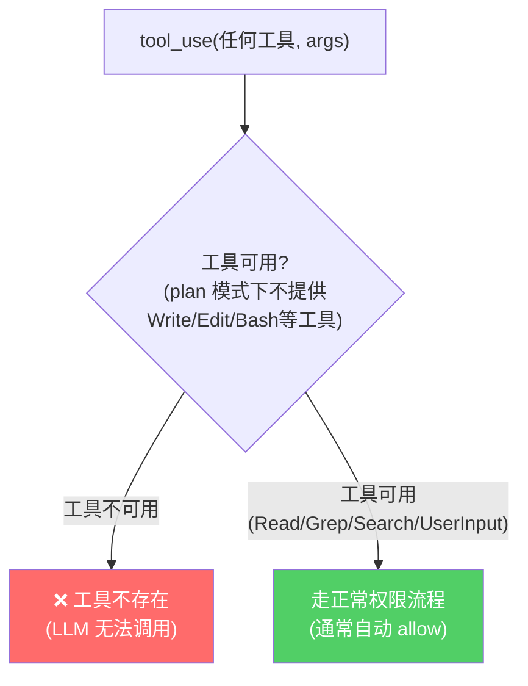
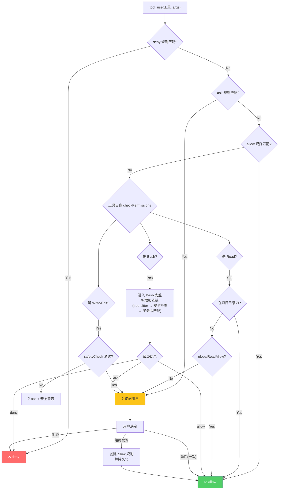
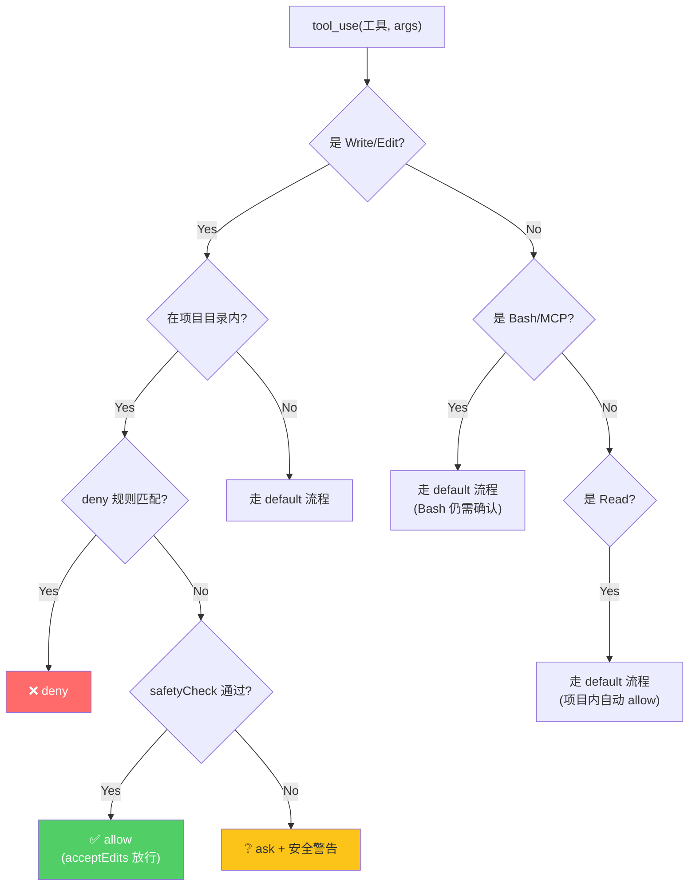
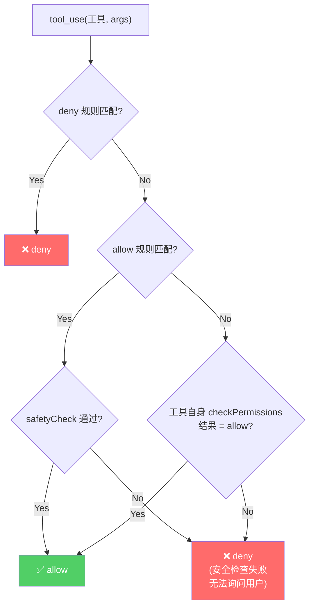
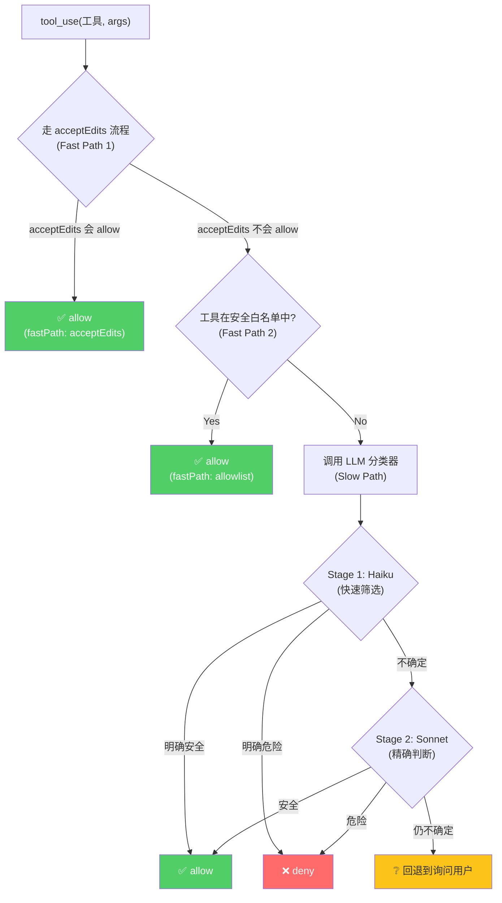
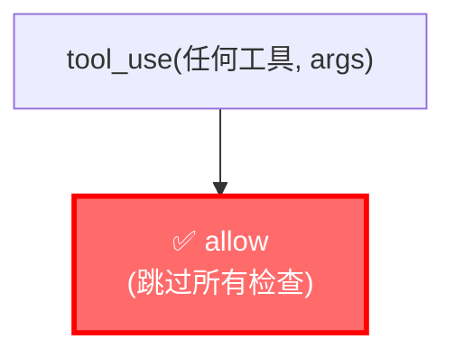
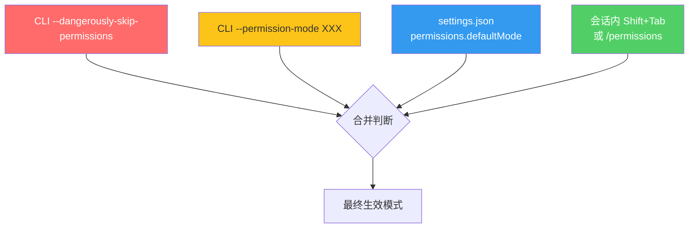

# Claude Code 六种权限模式深度解析

> 基于 Claude Code v2.1.85 bundle 逆向 + [官方安全文档](https://docs.claude.com/en/docs/claude-code/security) + [Anthropic 工程博客](https://www.anthropic.com/engineering/claude-code-sandboxing)
>
> **一句话总结**：6 种模式不是 6 个开关，而是 6 种完全不同的"检查链路由策略"。理解它们的关键不是看名字，而是看每种模式下每次 `tool_use` 会走哪些检查节点。

---

## 目录

1. [为什么需要 6 种模式？](#1-为什么需要-6-种模式)
2. [六种模式总览](#2-六种模式总览)
3. [每种模式的决策流详解](#3-每种模式的决策流详解)
4. [模式切换机制](#4-模式切换机制)
5. [企业管控与模式禁用](#5-企业管控与模式禁用)
6. [模式与沙箱/Hook 的交互](#6-模式与沙箱hook-的交互)
7. [实际场景选型指南](#7-实际场景选型指南)
8. [附录：Bundle 源码定位](#附录bundle-源码定位)

---

## 1. 为什么需要 6 种模式？

Claude Code 面对一个核心矛盾：**安全性与效率不可兼得**。

```
安全性 ←─────────────────────────────────────────────→ 效率
│                                                      │
│  plan        default      acceptEdits    dontAsk     │  auto       bypass
│  ────        ───────      ───────────    ──────      │  ────       ──────
│  完全不执行   每次都问      文件编辑放行   不匹配就拒绝  │  LLM判断     全部放行
│                                                      │
│  ← 越安全                                 越高效 →    │
│  适合审查场景                           适合自动化场景  │
```

一个只有"全开"和"全关"的系统是不可用的。6 种模式覆盖了从"只看不动"到"完全放飞"的完整频谱，且每种模式都有**精确定义的安全边界**。

---

## 2. 六种模式总览

### 2.1 Bundle 中的定义

```javascript
// L104782 — 权限模式枚举
Xj8 = ["acceptEdits", "bypassPermissions", "default", "dontAsk", "plan"];  // 经典5模式
XD4 = [...Xj8, "auto"];   // 全部6模式（auto 后来加入）
ff = XD4;                  // 对外暴露的完整列表
```

```javascript
// L299351 — 模式描述（schema 级别）
h.enum(["default", "acceptEdits", "bypassPermissions", "plan", "dontAsk"])
  .describe(
    "Permission mode for controlling how tool executions are handled. " +
    "'default' - Standard behavior, prompts for dangerous operations. " +
    "'acceptEdits' - Auto-accept file edit operations. " +
    "'bypassPermissions' - Bypass all permission checks (requires allowDangerouslySkipPermissions). " +
    "'plan' - Planning mode, no actual tool execution. " +
    "'dontAsk' - Don't prompt for permissions, deny if not pre-approved."
  )
```

### 2.2 对比矩阵

| 维度 | `plan` | `default` | `acceptEdits` | `dontAsk` | `auto` | `bypassPermissions` |
|------|--------|-----------|---------------|-----------|--------|---------------------|
| **安全等级** | 🔒🔒🔒🔒🔒 | 🔒🔒🔒🔒 | 🔒🔒🔒 | 🔒🔒🔒 | 🔒🔒 | 🔒 (无) |
| **效率等级** | ⚡ | ⚡⚡ | ⚡⚡⚡ | ⚡⚡⚡ | ⚡⚡⚡⚡ | ⚡⚡⚡⚡⚡ |
| **文件读取** | ✅ 可用 | ✅ 自动 (项目内) | ✅ 自动 (项目内) | ✅/❌ 规则决定 | ✅ 自动 | ✅ 全部自动 |
| **文件写入** | ❌ 工具不可用 | ❔ 询问用户 | ✅ 自动 (项目内) | ✅/❌ 规则决定 | ✅/❌ LLM 判断 | ✅ 全部自动 |
| **Bash 执行** | ❌ 工具不可用 | ❔ 询问用户 | ❔ 询问用户 | ✅/❌ 规则决定 | ✅/❌ LLM 判断 | ✅ 全部自动 |
| **MCP 调用** | ❌ 工具不可用 | ❔ 询问用户 | ❔ 询问用户 | ✅/❌ 规则决定 | ✅/❌ LLM 判断 | ✅ 全部自动 |
| **用户交互** | 无弹窗 | 频繁弹窗 | 较少弹窗 | 无弹窗 | 偶尔弹窗 | 无弹窗 |
| **适用场景** | 代码审查 | 日常开发 | 信任编辑 | CI/CD | 长时任务 | 容器/VM |
| **限制方式** | 工具可用性 | 权限检查 | 权限检查 | 权限检查 | LLM 分类器 | 无限制 |

---

## 3. 每种模式的决策流详解

### 3.1 `plan` 模式 — 只读分析，完全不执行



**核心行为**：plan 模式的工具限制**不是通过权限检查拦截实现的**，而是通过**不向 LLM 提供写入/执行工具**来实现。LLM 根本看不到 Write/Edit/Bash 等工具，自然无法调用。官方 schema 描述为 "Planning mode, no actual tool execution"（L299351）。

**设计意图**：让 Claude 做分析和规划（"如果要做 X，需要改哪些文件？"），但不真正执行任何修改。适合代码审查、方案讨论、影响分析。退出 plan 模式时系统注入消息 "You have exited plan mode. You can now make edits, run tools, and take actions"（L476040），明确告知 LLM 现在可以执行工具了。

**实现细节**：
- 切换到 `plan` 时，调用 `prepareContextForPlanMode()` 保存原始模式到 `prePlanMode`
- 切回时恢复原始模式（`Ba()` L473312-473323）
- 切换到 `plan` 时触发 `hy(!0)` — 表示 plan 已激活

**隐含行为**：
- 只读工具（Read/Grep/Search/ListDir）仍然可用——agent 需要读代码才能分析
- 退出 plan 模式后自动恢复到之前的权限模式（通过 `prePlanMode` 保存/恢复）
- agent 仍然可以输出分析结果和方案（纯文本），只是不能执行任何修改工具

### 3.2 `default` 模式 — 标准交互式



**核心行为**：
- **项目内 Read** → 自动 allow（agent 需要读项目代码）
- **项目外 Read** → 如果没有 allow 规则 → ask
- **Write/Edit** → 走完规则引擎后如果无匹配 → 一律 ask
- **Bash** → 走独立的 Bash 权限链（tree-sitter 解析 → 安全检查 → 子命令匹配）
- **MCP** → 走规则引擎，无匹配 → ask

**设计理念**：这是"安全第一，宁可多问不可漏放"的模式。用户的每一次"Always allow"都会创建一条持久化的 allow 规则，随着使用逐渐减少弹窗——但起点是"什么都问"。

**实践痛点**：频繁弹窗导致"审批疲劳"（approval fatigue）。在日常开发中，每次文件写入、每次 Bash 命令都需要点击 approve，打断工作流。这正是 `acceptEdits` 和 `auto` 诞生的动机。

### 3.3 `acceptEdits` 模式 — 信任文件编辑



**核心行为**：在 `default` 的基础上，**项目目录内的文件 Write/Edit 自动 allow**（前提是通过 safetyCheck 且无 deny 规则匹配）。

**关键区别**：
- `default` 下 `Write(src/app.ts, ...)` → 询问用户
- `acceptEdits` 下 `Write(src/app.ts, ...)` → 自动允许
- 但无论哪种模式，`Write(~/.bashrc, ...)` → 仍然被 safetyCheck 拦截

**Bash 不受影响**：这是 `acceptEdits` 最重要的设计决策。即使信任 Claude 编辑文件，Bash 命令仍然走完整检查链。原因：
1. 文件编辑的 blast radius 有限（最多损坏一个文件，可以 git revert）
2. Bash 命令的 blast radius 无限（可以 `rm -rf /`、`curl | sh`）

**典型用户**：相信 Claude 的代码编写能力、但不完全信任其 shell 命令的开发者。

### 3.4 `dontAsk` 模式 — 静默决策，不弹窗



**核心行为**：和 `default` 走相同的规则匹配逻辑，但**把所有 `ask` 结果替换为 `deny`**。因为 `dontAsk` 的核心语义是"不要弹出任何权限提示"。

**设计意图**：专为 **CI/CD 和非交互式场景** 设计。在没有人工介入的环境中，`ask` 会导致进程永久挂起。`dontAsk` 确保：
- 有明确 allow 规则的操作 → 自动放行
- 没有规则覆盖的操作 → 静默拒绝（不挂起）

**典型配置**：
```bash
claude -p "Run tests" \
  --permission-mode dontAsk \
  --allowedTools "Bash(npm test),Bash(npm run lint),Read"
```

**与 bypass 的区别**：
| | `dontAsk` | `bypassPermissions` |
|---|---|---|
| deny 规则 | ✅ 尊重 | ❌ 忽略 |
| allow 规则 | ✅ 尊重 | ❌ 忽略（全部 allow）|
| safetyCheck | ✅ 执行 | ❌ 跳过 |
| 无匹配时 | ❌ deny | ✅ allow |
| 安全性 | 中等（预配置白名单） | 无（完全裸奔） |

> [!TIP]
> `dontAsk` 是 CI/CD 场景的推荐选择。搭配 `--allowedTools` 精确指定允许的工具列表，既能自动化又不会完全失控。

### 3.5 `auto` 模式 — LLM 分类器智能判断



**核心行为**：用一个「安全分类器 LLM」替代人类做权限判断。但不是无脑调用 LLM，而是三级快速路径：

1. **Fast Path 1（acceptEdits 模拟）**：把当前 context 的 mode 临时设为 `acceptEdits`，重跑 `checkPermissions()`。如果 `acceptEdits` 会 allow → 直接 allow，不调 LLM。
2. **Fast Path 2（安全白名单）**：Read、ListDir、Grep、Search、UserInput 等只读工具 → 直接 allow。
3. **Slow Path（LLM 分类器）**：两阶段模型——先用 Haiku（便宜/快），不确定时升级到 Sonnet（准确/贵）。

**关键细节**：
- 分类器有独立的 system prompt（~1500 字），包含 12 条评估规则和 6 条用户意图规则
- 用户可以通过 `autoMode.allow` / `autoMode.soft_deny` / `autoMode.environment` 注入自然语言安全策略
- 分类器不是独立工作——它的输入包含完整的对话历史（transcript），可以理解上下文
- 连续被拒绝计数器（`consecutiveDenials` / `totalDenials`）检测 agent 是否陷入循环

**进入 `auto` 模式时的安全措施**：
```javascript
// L473317 — 进入 auto 时调用 dm() = stripDangerousPermissions
if (Y && !z) {
    // 检查 auto mode gate 是否启用
    if (!ek()) throw Error("Cannot transition to auto mode: gate is not enabled");
    QG?.setAutoModeActive(true);
    _ = dm(_);  // 剥离危险权限规则
}
```

`stripDangerousPermissions (dm)` 做了什么？
- 扫描所有 allow 规则
- 移除"过于宽泛的 Bash 权限"（如 `Bash(*)`, `Bash(python *)`, `Bash(node *)`）
- 这些规则在 default/acceptEdits 模式下可能是安全的（因为有人工审批），但在 auto 模式下与 LLM 分类器结合会产生权限升级风险
- 退出 auto 模式时通过 `restoreDangerousPermissions (ma)` 恢复

**Anthropic 的数据**：开启**沙箱**后，权限弹窗减少了 **84%**（来源：Anthropic 沙箱博客。注意：84% 是沙箱功能的效果，auto 模式在此基础上进一步减少弹窗）。

> [!WARNING]
> Auto 模式的分类器**可能被 prompt injection 绕过**——因为分类器本身也是 LLM。这就是为什么沙箱层是必要的（参见 [agent-sandbox-deep-dive.md](./agent-sandbox-deep-dive.md) §2.7）。Auto 模式 ≠ 安全模式，它只是让**大多数安全操作**不需要人工批准。

### 3.6 `bypassPermissions` 模式 — 完全跳过所有检查



**核心行为**：在检查链的最前端短路返回 allow。不走规则引擎、不做 safetyCheck、不调分类器、不弹窗。

**启用方式**：
```bash
claude --dangerously-skip-permissions  # CLI 标志
# 或
claude --permission-mode bypassPermissions
```

**启动时的 disclaimer**：
```
⚠️ WARNING: All permission checks are disabled.
   This mode should only be used in isolated environments.
```

**设计意图**：专用于以下场景：
1. **Docker 容器 / VM** —— 环境本身是隔离的，损坏了重建就行
2. **CI/CD pipeline** —— 自动化测试环境
3. **Claude Code on the web** —— 运行在 Anthropic 管理的沙箱 VM 中

> [!CAUTION]
> **绝对不要在本地开发机上使用 bypass 模式**。这等于给 agent 你的 Mac/Linux 的完整权限——它可以读取 `~/.ssh/id_rsa`、修改 `~/.bashrc`、执行 `rm -rf ~`、`curl | sh` 下载恶意脚本。所有这些操作都不会有任何提示。

**子 agent 继承**：
> ⚠️ 在 bypass 模式下启动的子 agent（subagent）**继承**相同的 bypass 权限。子 agent 执行的所有操作都不受任何限制。

---

## 4. 模式切换机制

### 4.1 Shift+Tab 循环

在交互式 CLI 中，按 `Shift+Tab` 在可用模式之间循环：

实际的循环由 `BH6()` (L502080) 实现，包含条件分支：

```
default → acceptEdits → plan → [bypassPermissions（如果可用）] → [auto（如果可用）] → default
```

```javascript
// L502080 — BH6: 计算下一个模式
function BH6(q, K) {
  switch (q.mode) {
    case "default":          return "acceptEdits";
    case "acceptEdits":      return "plan";
    case "plan":
      if (q.isBypassPermissionsModeAvailable) return "bypassPermissions";
      if (hUK(q)) return "auto";  // auto 可用时
      return "default";
    case "bypassPermissions":
      if (hUK(q)) return "auto";
      return "default";
    case "dontAsk":          return "default";  // 只能退出，不能循环进入
    default:                 return "default";  // auto → default
  }
}
```

> [!NOTE]
> `dontAsk` 只能通过 CLI 参数或 settings.json 进入，不能通过 Shift+Tab 循环进入。但如果当前处于 dontAsk，按 Shift+Tab 会回到 default。`bypassPermissions` **在 `isBypassPermissionsModeAvailable` 为 true 时会出现在循环中**（通常是通过 `--dangerously-skip-permissions` 启动后才可用）。

### 4.2 mode 优先级解析

模式可以在多个层级设置，解析逻辑如下（高优先级覆盖低优先级）：



**特殊规则**（来自 `initialPermissionModeFromCLI()` L473344）：

1. `--dangerously-skip-permissions` 直接推入 `bypassPermissions`
2. 如果多个来源都指定了 mode，**以最后生效的为准**（非并集，是覆盖）
3. 在 `CLAUDE_CODE_REMOTE`（即 Claude Code on the web）模式下，**只允许** `acceptEdits`、`plan`、`default`——不允许 `auto`、`bypass`、`dontAsk`
4. 如果 auto mode circuit breaker 激活（因错误率过高自动熔断），auto 会降级为 default

### 4.3 模式切换的状态保存

切换到 `plan` 模式时，原始模式被保存：

```javascript
// L473312 — 切换到 plan 时
if (K === "plan" && q !== "plan") return PL6(_);
// PL6 = prepareContextForPlanMode — 保存 prePlanMode = 当前模式

// L473320 — 从 plan 切回时
if (q === "plan" && K !== "plan" && _.prePlanMode) return {
    ..._, prePlanMode: undefined
};
// 恢复之前的模式
```

切换到 `auto` 模式时，危险权限被暂存：

```javascript
// L473317 — 进入 auto
dm(_)  // 剥离危险 Bash allow 规则

// L473318 — 退出 auto
ma(_)  // 恢复之前剥离的规则
```

---

## 5. 企业管控与模式禁用

### 5.1 管理员可禁用的模式

企业管理员通过 `policySettings`（managed-settings.json 或 MDM）可以锁定特定模式：

| 配置项 | 效果 |
|--------|------|
| `permissions.disableBypassPermissionsMode: "disable"` | 禁止 `bypassPermissions`——即使用 `--dangerously-skip-permissions` 也无效 |
| `disableAutoMode: "disable"` | 禁止 `auto` 模式 |
| `allowManagedPermissionRulesOnly: true` | 丢弃所有非 managed 来源的权限规则（用户/项目/本地设置的 allow/deny/ask 全部无效） |

### 5.2 CLAUDE_CODE_REMOTE 限制

当运行在云端环境（Claude Code on the web）时，可用模式被严格限制：

```javascript
// L473367
if (CLAUDE_CODE_REMOTE && !["acceptEdits", "plan", "default"].includes(H)) {
    // 警告："{mode}" is not supported in CLAUDE_CODE_REMOTE
    // 直接忽略该设置
}
```

原因：云端环境的安全由 Anthropic 的基础设施保障（VM 隔离、git proxy、scoped credentials），不需要也不应该让用户使用 bypass 或 dontAsk。

### 5.3 Auto Mode Circuit Breaker

Auto mode 有自动熔断机制。当分类器错误率过高时（通过 `getAutoModeEnabledState()` 检查），系统自动降级：

```javascript
// L473359 — 检查缓存的 circuit breaker 状态
if (A) {  // OF8() === "disabled"
    log("auto mode circuit breaker active (cached) — falling back to default", { level: "warn" });
    // 不推入 "auto"，降级到 default
}
```

---

## 6. 模式与沙箱/Hook 的交互

### 6.1 模式 × 沙箱矩阵

| 模式 | 沙箱是否生效？ | 说明 |
|------|--------------|------|
| `plan` | N/A | 不执行 Bash，沙箱不会被触发 |
| `default` | ✅ | 沙箱包裹所有 Bash 命令（如果沙箱启用） |
| `acceptEdits` | ✅ | 同上。注意：Write/Edit 不走沙箱（见 [agent-sandbox-deep-dive.md](./agent-sandbox-deep-dive.md) §2.8） |
| `dontAsk` | ✅ | 沙箱独立于权限模式运行 |
| `auto` | ✅✅ | **沙箱 + auto 是推荐组合**。沙箱启用时 `isAutoAllowBashIfSandboxedEnabled()` 可以让 Bash 在沙箱内自动 allow，进一步减少弹窗 |
| `bypassPermissions` | ⚠️ 取决于配置 | bypass 跳过权限检查，但沙箱配置独立于权限模式。如果 `useSandbox: true`，即使 bypass 模式 Bash 仍在沙箱中执行 |

### 6.2 模式 × Hook 矩阵

| 模式 | PreToolUse Hook 触发? | PermissionRequest Hook 触发? |
|------|---------------------|---------------------------|
| `plan` | ❌（不执行工具） | ❌ |
| `default` | ✅（在权限通过后） | ✅（在弹窗展示前） |
| `acceptEdits` | ✅ | ✅（仅对非文件编辑的 ask） |
| `dontAsk` | ✅（仅对 allow 的工具） | ❌（无弹窗） |
| `auto` | ✅ | ❌（分类器替代了弹窗） |
| `bypassPermissions` | ✅ | ❌（无弹窗） |

> [!IMPORTANT]
> **PreToolUse Hook 是唯一在所有执行模式下都触发的拦截点**（除 plan 外）。即使在 bypass 模式下，PreToolUse Hook 仍然执行。这意味着你可以通过 Hook 实现"在 bypass 模式下仍然检查某些规则"的效果。

---

## 7. 实际场景选型指南

### 场景一：日常开发（新项目/陌生代码）

```
推荐：default → 逐步切换到 acceptEdits
```

先用 default 让 Claude 的所有操作都经过你的审批。看几轮之后，如果你信任它的代码编辑能力，切到 `acceptEdits` 减少弹窗。Bash 命令保持 ask，因为你对项目的构建/测试流程还不完全了解。

### 场景二：信任项目的深度开发

```
推荐：acceptEdits + 自定义 allow 规则
```

```json
{
  "permissions": {
    "defaultMode": "acceptEdits",
    "allow": [
      "Bash(npm test)",
      "Bash(npm run lint)",
      "Bash(npm run build)",
      "Bash(git add *)",
      "Bash(git commit *)"
    ]
  }
}
```

文件编辑自动放行 + 常用开发命令自动放行 = 基本无弹窗但仍有安全底线。

### 场景三：长时间自动化任务

```
推荐：auto + sandbox
```

```bash
claude --permission-mode auto
# 在 Claude 中: /sandbox
```

Sandbox 提供 OS 级别的硬隔离（文件系统 + 网络），auto 提供应用层的智能判断。Anthropic 数据显示沙箱启用后权限弹窗减少 84%，加上 auto 模式可进一步减少剩余弹窗。安全基线由沙箱保底。

### 场景四：CI/CD Pipeline

```
推荐：dontAsk + 精确 allowedTools
```

```bash
claude -p "Run all tests and report results" \
  --permission-mode dontAsk \
  --allowedTools "Bash(npm test),Bash(npm run lint),Read,Grep"
```

不会弹窗、不会挂起、不会执行未经授权的操作。

### 场景五：容器化开发环境

```
推荐：bypassPermissions（仅在 Docker/VM 中）
```

```dockerfile
FROM node:20
RUN npm install -g @anthropic-ai/claude-code
CMD ["claude", "--dangerously-skip-permissions", "-p", "implement feature X"]
```

容器崩了重建就行，不需要权限检查的开销。

### 场景六：代码审查 / 方案讨论

```
推荐：plan
```

让 Claude 分析代码、提出方案、讨论 trade-off，但不执行任何修改。适合 code review 场景。

---

## 附录：Bundle 源码定位

| 功能 | Bundle 符号 | 行号 | 说明 |
|------|-----------|------|------|
| 权限模式枚举（经典 5 种） | `Xj8` | L104782 | `["acceptEdits", "bypassPermissions", "default", "dontAsk", "plan"]` |
| 权限模式枚举（全部 6 种） | `XD4` | L104782 | `[...Xj8, "auto"]` |
| 模式描述（schema） | `y46` | L299351 | 包含每种模式的官方描述 |
| 权限模式切换 | `Ba()` | L473308 | `transitionPermissionMode(fromMode, toMode, context)` |
| Shift+Tab 循环计算 | `BH6()` | L502080 | `cycleMode(context)` — 根据当前模式和可用性计算下一个模式 |
| 初始模式解析（CLI） | `eK7()` | L473344 | `initialPermissionModeFromCLI()` |
| 进入 plan 模式 | `PL6()` | — | `prepareContextForPlanMode()` |
| 剥离危险权限（auto 进入） | `dm()` | — | `stripDangerousPermissionsForAutoMode()` |
| 恢复危险权限（auto 退出） | `ma()` | — | `restoreDangerousPermissions()` |
| 检测过宽 Bash 规则 | `oK7()` | — | `isOverlyBroadBashAllowRule()` |
| 检测过宽 PowerShell 规则 | `aK7()` | — | `isOverlyBroadPowerShellAllowRule()` |
| 检测危险 Bash 权限 | `gxK()` | L473099 | `isDangerousBashPermission()` |
| bypass 禁用检查 | `qa()` | — | `isBypassPermissionsModeDisabled()` |
| auto gate 检查 | `ek()` | — | `isAutoModeGateEnabled()` |
| auto 不可用原因 | `pa()` | — | `getAutoModeUnavailableReason()` |
| auto circuit breaker | `OF8()` | — | `getAutoModeEnabledStateIfCached()` |
| 设置中的模式选项 | `permissions.defaultMode` | L385932 | options: `["default", "plan", "acceptEdits", "dontAsk", "auto"]` |
| REMOTE 模式限制 | — | L473367 | 只允许 `acceptEdits`, `plan`, `default` |
| 安全白名单 | `zTY` | L472409 | auto-mode 跳过 LLM 的安全工具列表 |
| 分类器 prompt | `oLq` | L277879 | ~1500 字的安全分类器 system prompt |
| 危险命令前缀列表 | `uxK` | L473056 | python/node/bash/ssh 等执行器前缀 |

> **行号对照**: 所有行号基于 `cli.beautified.js`（js-beautify 格式化后的 541,614 行版本）。

---

## 附录 B：为什么工具调用必须使用绝对路径？

### 背景

Claude Code 的所有文件操作工具（Read、Write、Edit）在 schema 中**强制要求绝对路径**：

| 工具 | `file_path` 描述 |
|------|-----------------|
| Read | `The absolute path to the file to read` |
| Write | `The absolute path to the file to write (must be absolute, not relative)` |
| Edit | `The absolute path to the file to modify` |

同时，Glob 和 Grep 的 `path` 参数可选（默认为 cwd），但 LLM 在实际调用中仍倾向于使用绝对路径。

子 agent（subagent）的 system prompt 中更是明确指出：

> *"Agent threads always have their cwd reset between bash calls, as a result please only use absolute file paths."*

### 这是预期行为，不是错误

绝对路径是 **by design** 的，核心原因有三：

#### 1. 权限系统依赖路径判断

权限检查的核心逻辑之一是判断操作目标是否在**项目目录内**：

```
Read(src/app.ts)          → 相对路径，项目内？项目外？无法确定
Read(/Users/me/proj/src/app.ts)  → 绝对路径，明确在项目内 ✅
Read(/etc/passwd)         → 绝对路径，明确在项目外 ❌
```

权限模式的多项规则依赖这个判断：
- `default` 模式：项目内 Read 自动 allow，项目外 Read 需要 ask
- `acceptEdits` 模式：项目内 Write/Edit 自动 allow，项目外仍需 ask
- `auto` 模式：分类器需要知道操作是否越界
- 规则引擎的 path glob 匹配（如 `allow: ["Read(src/**/*.ts)"]`）需要可靠的路径比较

如果使用相对路径，权限系统无法可靠地判断 `../../etc/passwd` 是否在项目目录内（需要先 resolve 成绝对路径）。直接要求绝对路径消除了这类歧义。

#### 2. Bash cwd 在子 agent 中不持久化

Claude Code 的子 agent（subagent）每次 Bash 调用的 cwd 都会被重置。这意味着：

```bash
# 子 agent 第一次调用
cd src && ls          # 在 src/ 下 ✅

# 子 agent 第二次调用（cwd 已重置回项目根目录）
cat app.ts            # 期望读 src/app.ts，实际读 ./app.ts ❌
```

绝对路径让每次调用都是自包含的、确定性的，不依赖于前一次调用的副作用。

#### 3. 审计和可追溯性

当用户在权限弹窗中看到：

```
Read: /Users/me/project/src/config.ts    # 清晰 ✅
Read: src/config.ts                       # 哪个项目的？ ❓
Read: ../../secrets/keys.json             # 看起来无害，实际在哪？ ⚠️
```

绝对路径让用户能一眼判断操作是否安全，不需要心算相对路径的解析结果。

### Enter CLI 当前状态：已与 Claude Code 一致

经过对比验证（via scribe 抓包），Enter CLI 的工具定义**已经与 Claude Code 完全一致**：

| 工具 | 路径参数 | 是否要求绝对路径 | Enter CLI | Claude Code |
|------|---------|----------------|-----------|-------------|
| Read | `file_path` | 是（schema + description 都写了 "absolute path"） | ✅ 一致 | ✅ |
| Write | `file_path` | 是（schema 写了 "absolute path"） | ✅ 一致 | ✅ |
| Edit | `file_path` | 是（schema 写了 "absolute path"） | ✅ 一致 | ✅ |
| Glob | `path` | 否（可选，默认 cwd） | ✅ 一致 | ✅ |
| Grep | `path` | 否（可选，默认 cwd） | ✅ 一致 | ✅ |
| Bash | N/A | 否（description 建议 "use absolute paths and avoid cd"） | ✅ 一致 | ✅ |

LLM 在调用 Glob/Grep 时也倾向于使用绝对路径，这不是错误——是因为：
1. system prompt 注入了 `Primary working directory: /abs/path`，LLM 据此自然拼出绝对路径
2. 子 agent 的 system prompt 明确要求 "only use absolute file paths"（两边都有）
3. Bash 的 description 建议 "use absolute paths"（两边都有）

**总结：所有工具调用都使用绝对路径是预期行为（by design），不是提示词错误。**

后续实现权限系统时，只需在**工具实现层**增加校验（对 Read/Write/Edit 拒绝相对路径输入），schema 和提示词不需要改动。
